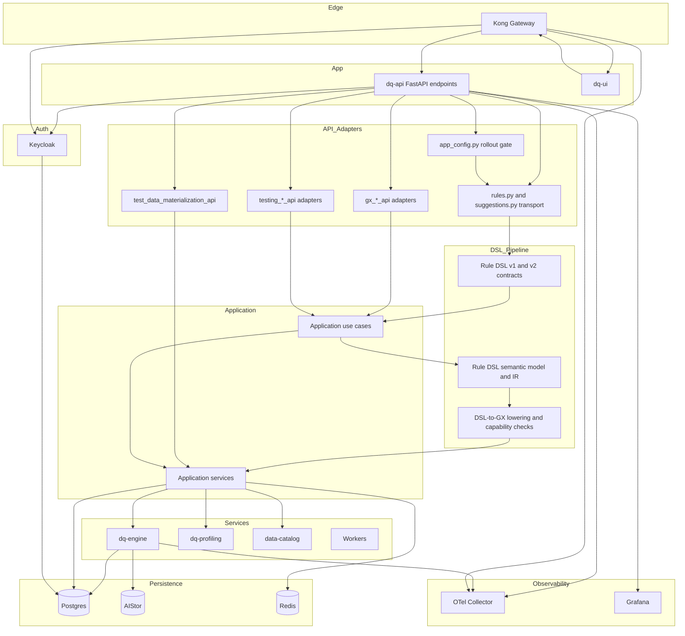

# API Layering & Endpoint Mapping

This document summarizes the current API layering in the repository after the DDD and endpoint-composition refactors. The important architectural shift is that the largest FastAPI surfaces are no longer expected to own orchestration directly: route modules are increasingly thin transport shells that delegate to explicit API adapter modules, application use cases, and typed repository or service seams.

With DQ DSL 2.0, the rule-definition path is now also explicitly layered. Rule mutation requests and DQ7 assistant drafts no longer behave like thin GX payload pass-throughs. They enter the FastAPI transport layer as versioned DSL contracts, are normalized into a canonical semantic model plus semantic IR inside the application/domain boundary, and are only then lowered to a target runtime such as GX.

## Quick mapping: key endpoints & environment variables

- **URL naming rule**: use audience-scoped names in repo env files and host-side scripts.
  - `*_INTERNAL_URL`: Docker-network URL between containers.
  - `*_LOCAL_URL`: host-local URL used from the compose machine.
  - `*_PUBLIC_URL`: browser-facing or internet-facing URL.
- **Gateway / Edge**: `KONG_INTERNAL_URL`, `KONG_LOCAL_URL`, `KONG_PUBLIC_URL`; admin endpoints: `KONG_ADMIN_INTERNAL_URL`, `KONG_ADMIN_LOCAL_URL`, `KONG_ADMIN_PUBLIC_URL`; manager GUI: `KONG_MANAGER_LOCAL_URL`, `KONG_MANAGER_PUBLIC_URL`.
- **API (FastAPI transport layer)**: `dq-api` is the primary REST surface, proxied under `/api`. OpenAPI docs are generated from the FastAPI app. `DQ_API_INTERNAL_URL` is reserved for Kong's upstream-to-API wiring; other containers must call the API through `KONG_INTERNAL_URL`. Host-local tooling still uses `DQ_API_LOCAL_URL`, and browser/UI runtime config stays audience-scoped rather than pointing at `dq-api` directly.
- **API adapters (explicit composition seams)**:
  - Rule-definition transport now enters through `app/api/v1/endpoints/rules.py` and `app/api/v1/endpoints/suggestions.py` rather than going straight to GX-oriented payload builders. `rules.py` accepts a versioned `dsl` union (`1.0.0` and `2.0.0`), while `suggestions.py` exposes the DQ7 assistant preview surface under `/data-catalog/v1/suggestions/dq7-dsl-assistant`.
  - GX flows now delegate through `app/api/v1/gx_run_plan_api.py`, `app/api/v1/gx_dispatch_api.py`, `app/api/v1/gx_runtime_api.py`, `app/api/v1/gx_start_api.py`, `app/api/v1/gx_suite_api.py`, `app/api/v1/gx_execution_api.py`, `app/api/v1/gx_report_api.py`, `app/api/v1/execution_browse_api.py`, and `app/api/v1/gx_assistance_api.py`.
  - Testing and materialization flows now delegate through `app/api/v1/testing_data_requests_api.py`, `app/api/v1/testing_generated_data_api.py`, `app/api/v1/testing_workflows_api.py`, `app/api/v1/testing_api.py`, and `app/api/v1/test_data_materialization_api.py`.
  - The route modules under `app/api/v1/endpoints` are now primarily transport, dependency-injection, logging, tracing, and HTTP/detail mapping shells.
- **UI**: `dq-ui` served for local dev via Vite (dev proxy) or static via Nginx. Local browser origins are `UI_VITE_LOCAL_URL` and `UI_NGINX_LOCAL_URL`; public API/browser access still goes through `KONG_PUBLIC_URL`.
- **Application layer**: orchestrating use cases now live under `app/application/use_cases`, with shared orchestration and runtime seams under `app/application/services`. This is where rule lifecycle, DQ DSL normalization and lowering, GX dispatch, queue-status queries, assistance requests, testing request flows, and materialization orchestration are expected to live.
- **DSL 2.0 semantic layer**: `app/domain/entities/rule_dsl_v2.py` and `app/domain/entities/rule_dsl_ir.py` are now the canonical semantic boundary for rule-definition requests. The rule mutation use case validates the versioned contract, builds semantic IR, checks runtime capability support, and only then lowers the request for the target engine.
- **Rule drafting / assistant services**: DQ7 assistant draft composition lives under `app/application/services/natural_language_rule_drafting.py`. That service builds previewable `2.0.0` DSL documents from suggestion inputs instead of emitting ad hoc runtime expressions.
- **Configuration / rollout gate**: the DSL 2.0 path is explicitly gated by `feature_rule_dsl_v2`, exposed through `app/api/v1/endpoints/app_config.py` and consumed in the rule mutation use case. Missing or disabled rollout state fails closed for `2.0.0` requests; there is no silent downgrade to DSL 1.0.
- **Domain Services / Workers**: `dq-engine`, `dq-profiling`, `data-catalog`, and other service containers. Service-to-service auth uses OIDC service clients; key envs:
  - `DQ_ENGINE_OIDC_ISSUER` or `DQ_ENGINE_OIDC_TOKEN_URL`
  - `DQ_ENGINE_OIDC_CLIENT_ID`
  - `DQ_ENGINE_OIDC_CLIENT_SECRET` (must be set for local Keycloak reconciliation)
- **RuleBuilder & Data Catalog Endpoints** (examples proxied via Kong):
  - RuleBuilder: `/rulebuilder/v1/...` (e.g. profiling enqueue: `/rulebuilder/v1/profiling/enqueue`)
  - Data Catalog: `/data-catalog/v1/...`
  - Profiling enqueue (dev): `PROFILING_GATEWAY_URL` defaults to `${KONG_LOCAL_URL%/}/rulebuilder/v1/profiling/enqueue`.
- **GX / queue runtime envs**: the repo now follows a fail-fast runtime policy for required queue configuration. Representative envs include `GX_EXECUTION_REDIS_URL` or `REDIS_URL`, queue-key envs resolved through `app/core/runtime_queues.py`, and worker-heartbeat keys consumed by the GX runtime adapter. Missing required queue keys now fail closed instead of substituting local defaults.
- **DSL rollout / contract envs**: the UI and API now rely on `feature_rule_dsl_v2` as the canonical rollout switch for `2.0.0` rule payloads. The backend still accepts `1.0.0` contracts for legacy/manual builder flows, but `2.0.0` requests are explicitly versioned and guarded rather than inferred.
- **Testing / materialization envs**: `DQ_TEST_DATA_OUTPUT_PREFIX`, `TEST_DATA_MATERIALIZATION_QUEUE_KEY`, `DQ_TEST_DATA_MATERIALIZATION_QUEUE_KEY`, `TEST_DATA_MATERIALIZATION_PROCESSING_QUEUE_KEY`, and the S3-compatible storage envs used by materialization helpers (`DQ_S3_ENDPOINT`, `DQ_S3_ACCESS_KEY`, `DQ_S3_SECRET_KEY`, related AWS aliases). These are also treated as required runtime composition inputs when a workflow depends on them.
- **Identity / Auth (Keycloak)**: `KEYCLOAK_INTERNAL_URL`, `KEYCLOAK_LOCAL_URL`, `KEYCLOAK_PUBLIC_URL`, `SSO_INTERNAL_ISSUER_URL`, `SSO_PUBLIC_ISSUER_URL`, `KEYCLOAK_REALM`, `KEYCLOAK_SYSTEM_ADMIN_USERNAME`, `KEYCLOAK_SYSTEM_ADMIN_PASSWORD`. Keycloak realm and client artifacts are generated by `dq-keycloak` scripts and reconciled during startup when seeding.
- **Persistence**: `DATABASE_URL` (Postgres), AIStor (S3 materializations/deliveries), `REDIS` for caches/coordination.
- **Observability**: `KONG_OTEL_ENDPOINT`, `VITE_OTEL_ENDPOINT`, `GRAFANA_PUBLIC_URL`.

## Endpoint ownership snapshot

- **Rule definition / mutation family**: `/rulebuilder/v1/rules...` now owns the versioned rule-definition transport contract. The endpoint layer accepts both DSL `1.0.0` and `2.0.0`, but semantic validation, rollout-gate enforcement, capability checks, and runtime lowering live in `app/application/use_cases/rule_mutation.py` plus the DSL services/entities it calls.
- **DQ7 assistant preview and draft family**: `/data-catalog/v1/suggestions/dq7-dsl-assistant` advertises engine support for DSL construct families, and natural-language suggestion drafts now carry previewable DSL `2.0.0` documents rather than only legacy check-type/source payloads.
- **GX lifecycle and query family**: the `/rulebuilder/v1/gx/...` surface is split across dedicated adapter modules rather than one monolithic endpoint implementation.
- **Testing and generated-data family**: queued test-data requests, manual/generated data, proof/report flows, and materialization completion now use explicit adapter modules instead of sharing transport logic through `testing_route_support.py`.
- **Data catalog materialization**: generic data-catalog materialization routes delegate through `test_data_materialization_api.py`, while lower-level helper wiring stays in `test_data_materialization_support.py`.
- **Compatibility surfaces**: `app/api/v1/testing_api.py` and `app/api/v1/gx_runtime_api.py` remain intentional adapter surfaces, and the repo now guards their importer boundaries with validation scripts instead of letting them become general-purpose shared modules.

## Operational notes

- Startup scripts follow the repository's No-Fallbacks (Fail-Fast) policy: host-side orchestration now uses the canonical INTERNAL/LOCAL/PUBLIC env naming scheme and still requires `KONG_PUBLIC_URL` for the browser-facing contract.
- Keycloak client secret reconciliation occurs in `scripts/start-containers.sh` (function `ensure_keycloak_engine_worker_client_secret_matches_env`) and requires `DQ_ENGINE_OIDC_CLIENT_SECRET` to be present when workers talk to the in-compose Keycloak.
- Rule-definition traffic is now intentionally mixed-mode during rollout: manual editor flows can still submit DSL `1.0.0`, while DQ7 assistant drafts and newer suggestion surfaces produce DSL `2.0.0`. The canonical boundary is the versioned API contract, not a hidden compatibility shim.
- DSL `2.0.0` requests fail fast when the rollout gate is unavailable or disabled, and they also fail fast when the selected runtime cannot preserve the requested semantics. The rule mutation path does not silently coerce unsupported constructs into weaker GX behavior.
- Required queue and runtime composition paths now fail fast by design. Profiling enqueue, queued test-data requests, GX dispatch, GX join-pair materialization dispatch, test-data materialization, and GX queue-status helpers no longer substitute built-in queue names when runtime config is absent.
- Architecture boundary enforcement is now partially automated. `scripts/validate_testing_architecture_boundaries.sh` guards the testing compatibility surface, and `scripts/validate_fastapi_api_adapter_boundaries.sh` keeps `testing_api.py` and `gx_runtime_api.py` on explicit importer allowlists.
- For endpoint discovery and smoke tests, many scripts source `tmp/dq_engine_oidc.env` (generated by `dq-keycloak/scripts/generate_seed_artifacts.sh`) — prefer explicit env vars to avoid relying on generated files.

## See also

- [scripts/start-containers.sh](scripts/start-containers.sh)
- [.env](.env)
- [dq-keycloak/scripts/generate_seed_artifacts.sh](dq-keycloak/scripts/generate_seed_artifacts.sh)
- [dq-ui/vite.config.ts](dq-ui/vite.config.ts)
- [docs/technical/gap-analysis/DDD_API_GAP_ANALYSIS.md](docs/technical/gap-analysis/DDD_API_GAP_ANALYSIS.md)

---

Generated on: 2026-05-06
