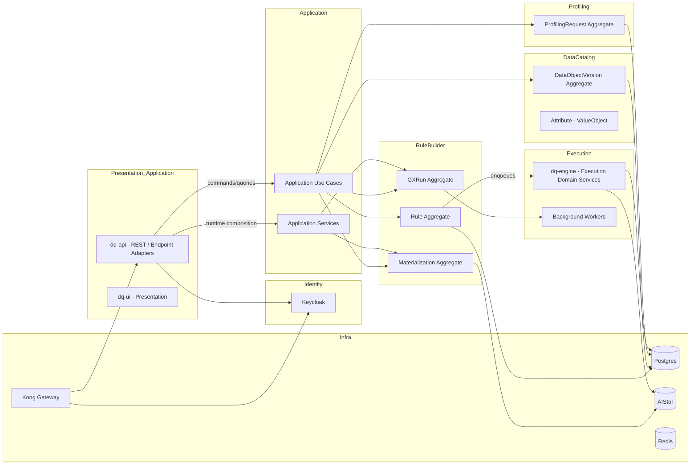
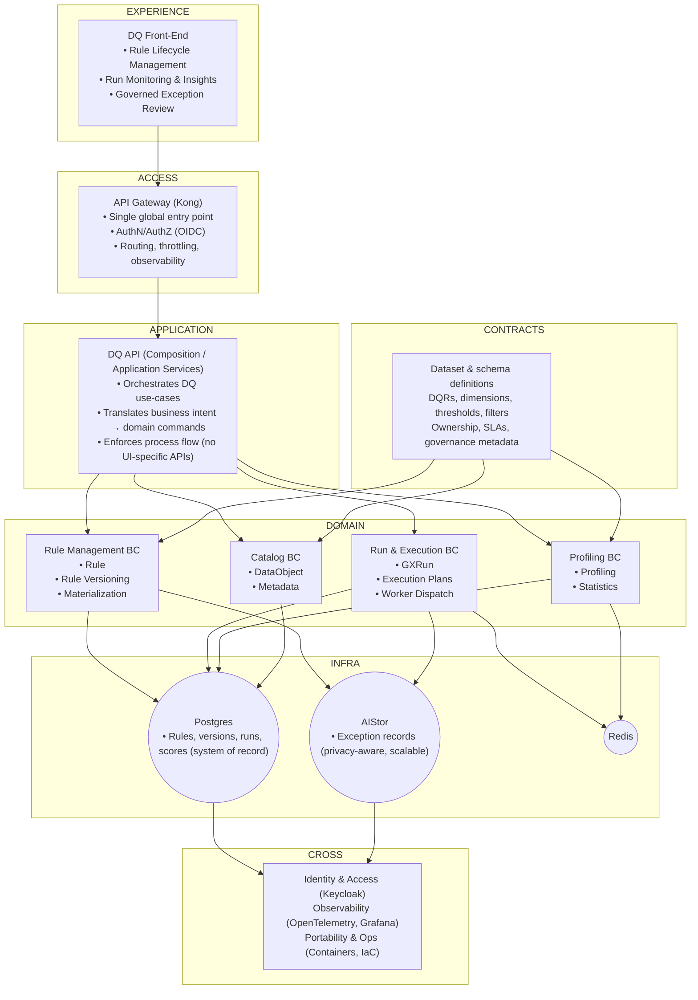

# DDD Implementation — Bounded Contexts & Mappings

This document shows how DDD currently maps to the repository's code structure and runtime components after the recent endpoint-composition and API-boundary refactors. The key change is that the repository now has clearer separation between transport adapters, application orchestration, domain entities and policies, and infrastructure-backed repositories, even though some large seams still remain in post-slice hardening.

## Mapping: code directories → bounded contexts & artifacts

- **Presentation / Application**
  - `dq-api`: REST endpoint shells plus explicit API adapter modules, application use cases, presenter modules, and repository adapters. See [dq-api](dq-api).
  - `dq-ui` / `dq-rules-ui`: UI adapters and client-side glue that call the API. See [dq-ui](dq-ui) and [dq-rules-ui](dq-rules-ui).

- **Rule Builder**
  - Aggregates: `Rule`, `Rule Version`, `GXRun`, `Run Plan`, `Materialization`.
  - Implementation: rule lifecycle, GX dispatch, run-plan validation/activation, testing data requests, and materialization orchestration are primarily composed in `dq-api/fastapi/app/application/use_cases` and `dq-api/fastapi/app/application/services`, with transport delegated through explicit API adapter modules under `app/api/v1`. Execution remains in `dq-engine`, and validation rules remain in [dq-domain-validation](dq-domain-validation).

- **Data Catalog**
  - Aggregates: `DataObjectVersion`, attribute/value objects.
  - Implementation: `data-catalog` service plus read/write entrypoints in `dq-api`; typed data-catalog entities and API presenters now carry more of the response-shaping boundary than the old endpoint-support modules did.

- **Profiling**
  - Aggregates: `ProfilingRequest` and associated profiling jobs.
  - Implementation: `dq-profiling` (profiling service and request generator), enqueue via RuleBuilder endpoints proxied through Kong. See [dq-profiling](dq-profiling).

- **Testing / Materialization**
  - Aggregates and records: queued test-data requests, generated-data proofs, test-data materialization requests, and materialized delivery notes.
  - Implementation: request/materialization orchestration now runs through explicit application use cases and the shared `test_data_materialization_service`, while HTTP transport and queue wiring live under `app/api/v1/testing_data_requests_api.py`, `app/api/v1/testing_generated_data_api.py`, `app/api/v1/testing_workflows_api.py`, and `app/api/v1/test_data_materialization_api.py`.

- **Execution**
  - Execution domain sits in `dq-engine`: workers, dispatchers, retry/backoff, materialization orchestration. On the API side, GX execution runtime composition is now mediated through explicit runtime and dispatch adapters plus typed GX entities instead of endpoint-local helper closures. Workers read OIDC client credentials (`DQ_ENGINE_OIDC_*`) to authenticate to Keycloak for token minting.

- **Identity**
  - Keycloak realm + clients are generated by `dq-keycloak` scripts. Runtime reconciliation and admin operations are handled via `scripts/start-containers.sh` (see `ensure_keycloak_engine_worker_client_secret_matches_env`).

- **Persistence & Infra**
  - Postgres (`DATABASE_URL`) stores domain state and aggregate snapshots/tables. AIStor stores materialization outputs. Redis backs queue and coordination paths. Kong is the gateway (public endpoint `KONG_PUBLIC_URL`). Repository composition now follows the repository-wide fail-fast policy for required infrastructure.

## Current DDD seam mapping

- **API adapters**: `app/api/v1/*_api.py` modules are explicit transport/composition seams. They bind HTTP requests to application commands, construct runtime callbacks, and shape API models without owning business policy.
- **Application use cases**: `app/application/use_cases` is now the main orchestration layer for rule lifecycle, GX dispatch/query flows, assistance requests, queue-status lookup, testing workflows, and materialization request/completion handling.
- **Application services**: `app/application/services` holds shared orchestration and runtime logic such as queue helpers, run-plan validation, seed resolution, grouped planning, delivery-linked execution resolution, and test-data materialization support.
- **Domain entities and policy**: `app/domain/entities` increasingly carries typed domain concepts rather than only payload shims. `rule_policy.py` and `rule_autopublish_policy.py` now model normalization-heavy behavior through explicit value objects.
- **Infrastructure adapters**: `app/infrastructure/repositories` and ORM-backed adapters remain the persistence boundary. The main repository seams now increasingly return typed entities instead of persistence-shaped dicts.

## How DDD concepts are applied (short)

- Aggregates: modeled as domain entities around `Rule`, `GXRun`, `Run Plan`, `DataObjectVersion`, `ProfilingRequest`, and testing/materialization records across the API and worker layers.
- Repositories: SQL-backed repositories live under `app/infrastructure/repositories`; several main seams now return typed entities rather than raw dictionaries, though some large repository modules still need broader coverage and cleanup.
- Application services / commands: HTTP endpoints in `dq-api` now mainly translate transport into commands, delegate orchestration to use cases, validate requests (via `dq-domain-validation` and typed entities), and dispatch work to `dq-engine` or queue-backed workers.
- Domain services & workers: `dq-engine` encapsulates rule execution, materialization orchestration, and GX run processing. Background workers take domain commands from the queue and update aggregates.
- Fail-fast composition: missing required database, queue, S3, OIDC, or runtime settings are treated as explicit failures rather than silently falling back to local defaults.
- Identity as a separate bounded context: Keycloak supplies tokens; domain services treat token issuance as an external capability (client_credentials flow for workers).

## Boundary enforcement notes

- `app/api/v1/testing_route_support.py` now exists only as a compatibility helper surface for focused tests, not as a live ownership seam for testing workflows.
- `app/api/v1/testing_api.py` and `app/api/v1/gx_runtime_api.py` are intentional compatibility and runtime adapter seams, and the repo guards their importer boundaries with validation scripts rather than relying only on convention.
- This means the DDD boundary is now partially enforced by repository tooling, not just by documentation and reviewer discipline.

## Layered DDD diagram

Generated on: 2026-04-25

