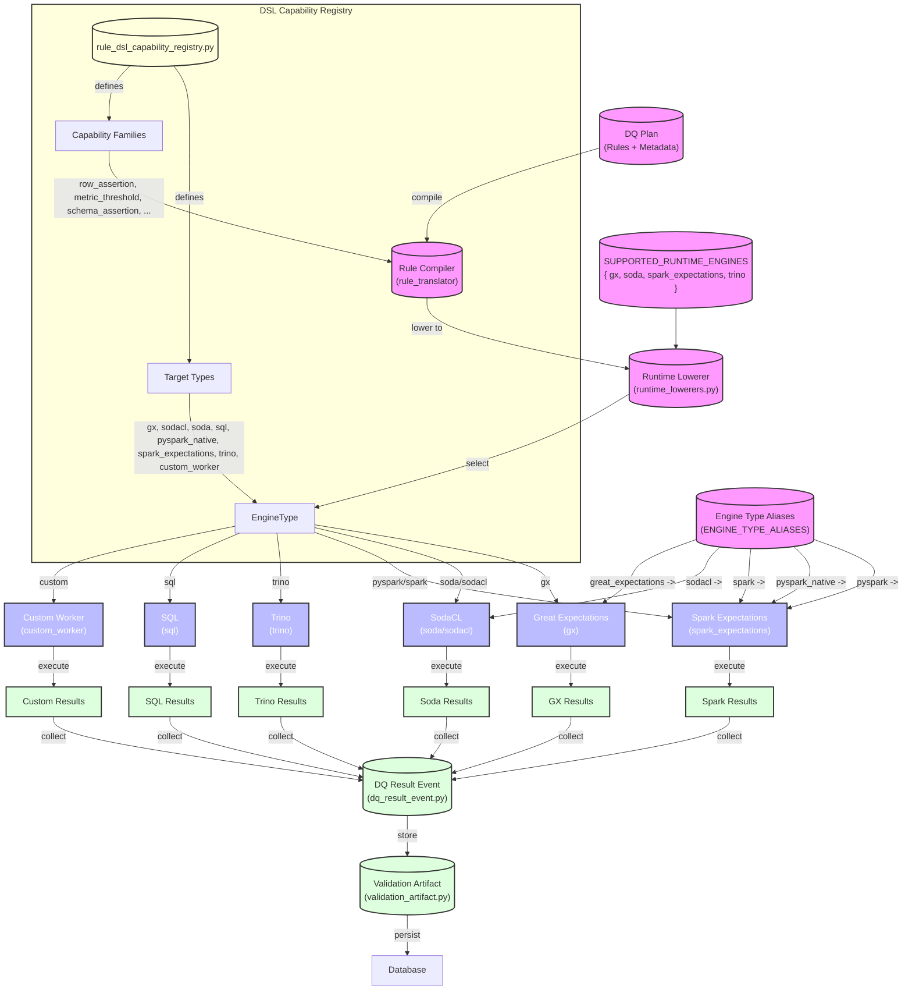

# DQ Engine Execution Flow

This document describes how Data Quality (DQ) engines relate to running a DQ plan in the Data Quality Made Easy platform.

## Overview

The DQ execution architecture supports multiple engine types that can execute data quality rules. Each engine has different capabilities and is optimized for specific use cases. The system uses a capability registry to track what each engine can do, and runtime lowerers to translate DQ rules into engine-specific execution plans.

## Supported DQ Engine Types

The platform currently supports the following DQ engine types:

| Engine | Normalized Name | Description |
|--------|----------------|-------------|
| Great Expectations | `gx` | Industry-standard Python data validation library |
| SodaCL | `soda` (from `sodacl`) | Lightweight data validation and monitoring |
| Spark Expectations | `spark_expectations` (from `pyspark`, `pyspark_native`, `spark`) | Spark-based data quality execution |
| Trino | `trino` | Trino SQL query engine for distributed execution |
| SQL | `sql` | Generic SQL-based execution |
| Custom Worker | `custom_worker` | Custom worker implementation for specialized cases |

## Execution Flow

The following diagram illustrates how DQ engines relate to running a DQ plan:

## Component Details

### DQ Plan
A DQ Plan contains:
- Data quality rules to be executed
- Metadata about the data objects being validated
- Configuration for how and when to run the rules

### Rule Compiler
The rule compiler (in `rule_translator`) translates high-level DQ rule definitions into a format that can be lowered to specific engine implementations. It handles the transformation from the abstract rule DSL to concrete execution plans.

### Runtime Lowerer
The runtime lowerer (`runtime_lowerers.py`) is responsible for:
- Selecting the appropriate engine based on configuration
- Normalizing engine type names using aliases
- Lowering rules to engine-specific execution formats
- Validating that the selected engine is supported

### Capability Registry
The DSL capability registry (`rule_dsl_capability_registry.py`) defines:
- **Target Types**: All supported engine types
- **Capability Families**: Categories of DQ checks (row assertions, metric thresholds, schema assertions, etc.)
- **Support Matrix**: What capabilities each engine supports (native, partial, sql, custom, or no support)

This registry ensures that the system knows which engine can execute which type of DQ check, enabling intelligent routing and validation.

### Engine Aliases
The system supports engine type aliases for flexibility:
- `pyspark` → `spark_expectations`
- `pyspark_native` → `spark_expectations`
- `spark` → `spark_expectations`
- `sodacl` → `soda`
- `great_expectations` → `gx`

These aliases allow users to reference engines by different names while the system normalizes them to a consistent internal representation.

## Supported Runtime Engines

The runtime lowerers currently support these normalized engine types:
- `gx` - Great Expectations
- `soda` - SodaCL
- `spark_expectations` - Spark Expectations
- `trino` - Trino

## Execution Process

1. **Plan Submission**: User submits a DQ plan with rules to be executed
2. **Compilation**: Rules are compiled from the DSL to an intermediate representation
3. **Lowering**: The runtime lowerer selects the appropriate engine and translates rules to engine-specific format
4. **Execution**: The selected engine executes the rules against the target data
5. **Result Collection**: Results from all executed rules are collected
6. **Result Processing**: Results are processed into DQ Result Events
7. **Persistence**: Validation artifacts are stored in the database for audit and reporting

## Engine Capabilities

Each engine has different strengths:

- **Great Expectations (gx)**: Full-featured, supports many rule types natively, integrates with Great Expectations ecosystem
- **SodaCL (soda)**: Lightweight, optimized for data monitoring, good for simple validations
- **Spark Expectations (spark_expectations)**: Distributed execution, handles large datasets, Spark-native operations
- **Trino (trino)**: SQL-based, leverages Trino's distributed query engine, good for federated data sources
- **SQL (sql)**: Generic SQL execution, portable across different SQL databases
- **Custom Worker (custom_worker)**: Flexible, can implement custom validation logic

## Related Files

- `dq-engine/runtime_lowerers.py` - Runtime lowerer implementation
- `dq-api/fastapi/app/domain/entities/rule_dsl_capability_registry.py` - DSL capability registry
- `dq-api/fastapi/app/domain/entities/dq_result_event.py` - DQ result event handling
- `dq-api/fastapi/app/domain/entities/validation_artifact.py` - Validation artifact storage
