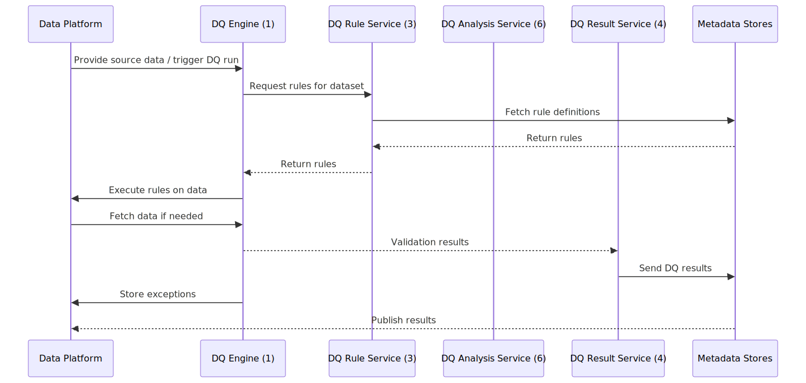
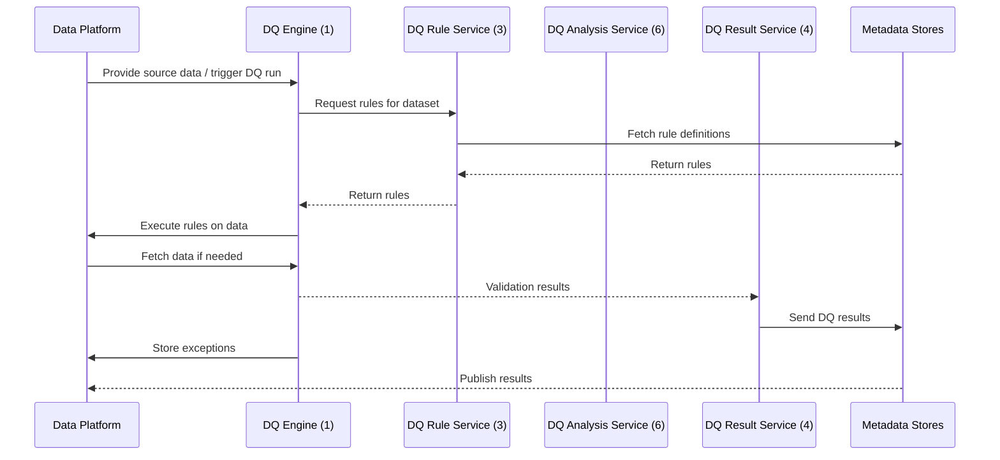

Data Quality Execution Flow

SVG asset: [dq-execution-flow.svg](./dq-execution-flow.svg)

```mermaid
sequenceDiagram
    participant DP as Data Platform
    participant Engine as DQ Engine (1)
    participant Rule as DQ Rule Service (3)
    participant Analysis as DQ Analysis Service (6)
    participant Result as DQ Result Service (4)
    participant Meta as Metadata Stores

    DP->>Engine: Provide source data / trigger DQ run
    Engine->>Rule: Request rules for dataset
    Rule->>Meta: Fetch rule definitions
    Meta-->>Rule: Return rules
    Rule-->>Engine: Return rules

    Engine->>DP: Execute rules on data
    DP->>Engine: Fetch data if needed
    Engine-->>Result: Validation results

    Result->>Meta: Send DQ results
    Engine->>DP: Store exceptions
    Meta-->>DP: Publish results

```
