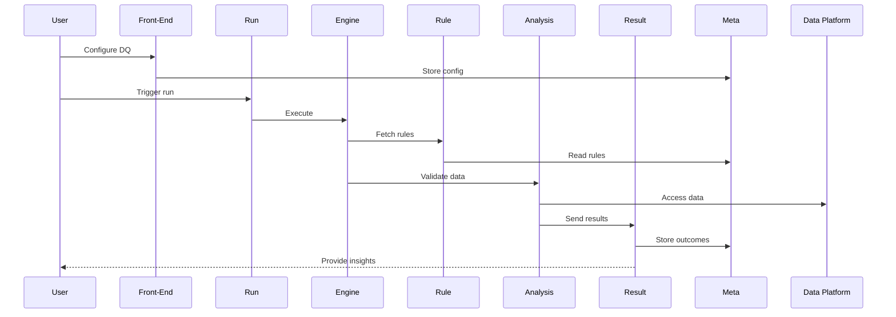

End-to-End view

SVG asset: [end-to-end-flow.svg](./end-to-end-flow.svg)

```mermaid
sequenceDiagram
    participant User
    participant FE as Front-End
    participant Run
    participant Engine
    participant Rule
    participant Analysis
    participant Result
    participant Meta
    participant DP as Data Platform

    User->>FE: Configure DQ
    FE->>Meta: Store config

    User->>Run: Trigger run
    Run->>Engine: Execute

    Engine->>Rule: Fetch rules
    Rule->>Meta: Read rules

    Engine->>Analysis: Validate data
    Analysis->>DP: Access data
    Analysis->>Result: Send results

    Result->>Meta: Store outcomes
    Result-->>User: Provide insights
```
