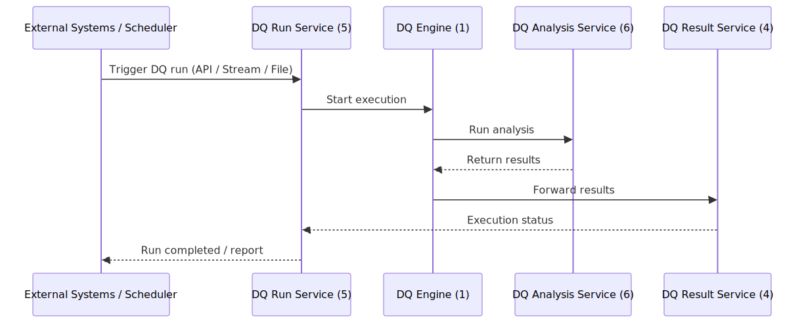
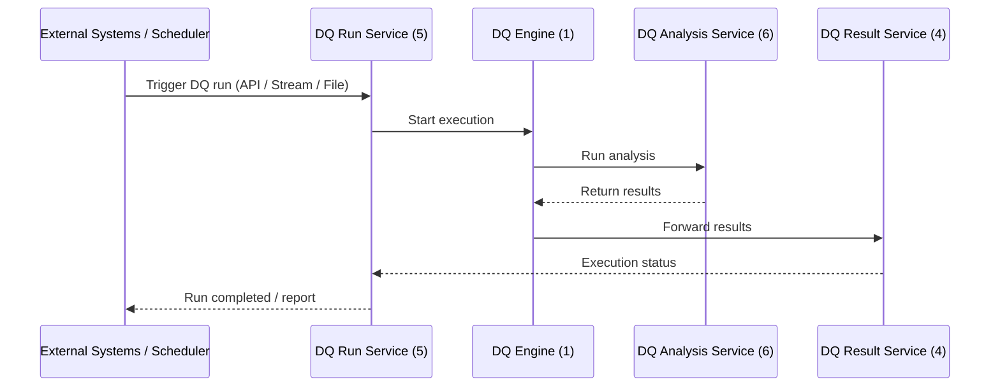

# Run Management & Orchestration Flow

SVG asset: [run-management-orchestration-flow.svg](./run-management-orchestration-flow.svg)

```mermaid

sequenceDiagram
    participant External as External Systems / Scheduler
    participant Run as DQ Run Service (5)
    participant Engine as DQ Engine (1)
    participant Analysis as DQ Analysis Service (6)
    participant Result as DQ Result Service (4)

    External->>Run: Trigger DQ run (API / Stream / File)
    Run->>Engine: Start execution

    Engine->>Analysis: Run analysis
    Analysis-->>Engine: Return results

    Engine->>Result: Forward results
    Result-->>Run: Execution status

    Run-->>External: Run completed / report
```
