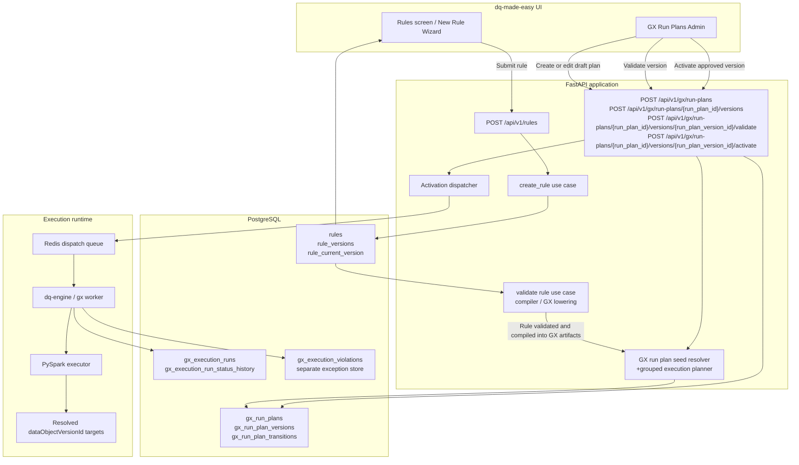
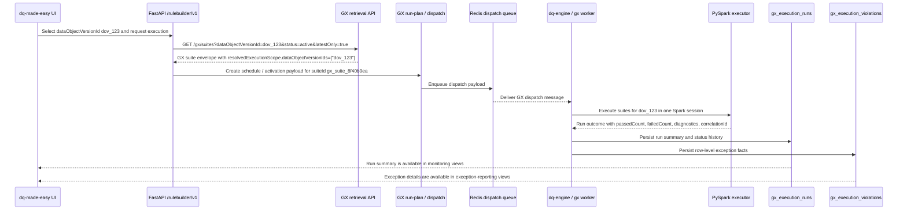

# DQ Rule to Run Plan Flow

This diagram shows how a dq-made-easy user creates a DQ rule in the UI, how the API stores it in PostgreSQL, and how an approved run plan activates execution through dq-engine.

SVG asset: [DQ_RULE_TO_RUN_PLAN_FLOW.svg](./DQ_RULE_TO_RUN_PLAN_FLOW.svg)

## Flow Diagram




## Reading The Diagram

1. The rule authoring UI sends the rule payload to the rules API.
2. The API persists the rule in PostgreSQL before the rule appears back in the UI.
3. The run-plan UI creates a draft GX run plan from the compiled GX artifact and its execution contract.
4. Validation updates the run-plan version state in PostgreSQL.
5. Activation enqueues a dispatch payload, and dq-engine executes the resulting batch against the resolved `dataObjectVersionId` targets.
6. Execution metadata stays in the run tables, while row-level violations go to the separate exception store.

## Worked Example

This sequence shows the current end-to-end path for one `dataObjectVersionId` run, including the separate result and exception persistence paths.



Example result shape:

```json
{
  "runId": "run_20260406_001",
  "suiteId": "gx_suite_8f40b9ea",
  "suiteVersion": 3,
  "dataObjectVersionId": "dov_123",
  "status": "succeeded",
  "passedCount": 12,
  "failedCount": 1,
  "correlationId": "corr_20260406_001"
}
```

Example exception-row shape:

```json
{
  "dataPrimaryKey": "order_id=4711",
  "ruleId": "rule_1",
  "violationReason": "customer_address is null",
  "recordIdentifierType": "primary_key",
  "recordIdentifierValue": "4711",
  "reasonCode": "completeness_not_null_violation",
  "reasonText": "customer_address must not be null",
  "dataObjectVersionId": "dov_123",
  "runId": "run_20260406_001"
}
```

The key boundary is that the aggregate run result and the row-level exception facts are persisted and read back through different stores and views.

## Notes

- Rule creation does not trigger execution by itself; a run plan is the explicit handoff into scheduling and runtime dispatch.
- The run-plan lifecycle is immutable at the version level, so each activation works from a specific snapshot.
- If the execution contract or required source mapping is missing, the runtime fails fast rather than substituting a fallback path.
