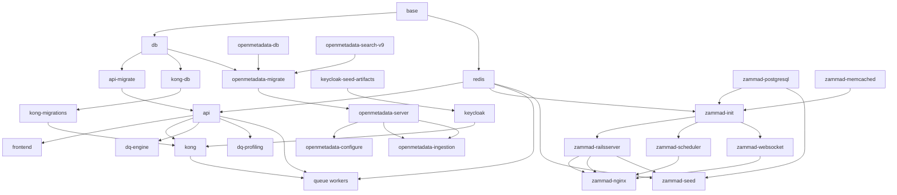

# Stack Script Contract

Last updated: 2026-07-14

## Purpose

This document records the current operator contract for the stack scripts in `scripts/`. It covers the canonical command entrypoints, the shared shell helpers they depend on, and the password management policy that governs lifecycle actions.

## Canonical Env Contract

All stack lifecycle entrypoints use the same env selection contract:

```bash
--env dev
--env test
--env prod
--env-file PATH
```

The canonical named env files are:

- `dev` -> `.env.dev.local`
- `test` -> `.env.test.local`
- `prod` -> `.env.prod.local`

`--env-file PATH` remains the explicit escape hatch for CI, `/etc`, and diagnostics.

## Orchestrator

The primary operator entry point is the orchestrator:

```
scripts/stack.sh <env> <action> [OPTIONS]
```

| Action | What it does | Calls |
| --- | --- | --- |
| `destroy` | Full teardown: containers, volumes, all generated artifacts | `stack_destroy.sh` |
| `stop` | Stop containers only; keeps volumes, secrets, credentials | `stack_stop.sh` |
| `start` | Generate secrets, rotate passwords, start containers | `stack_start.sh` |
| `start --seed` | Start then seed | `stack_start.sh` then `stack_seed.sh` |
| `restart` | Stop then start; reuse admin passwords, rotate service/user | `stack_restart.sh` |
| `restart --seed` | Restart then seed | `stack_restart.sh` then `stack_seed.sh` |
| `init` | Full clean reset: destroy → start → seed | `stack_destroy.sh` → `stack_start.sh` → `stack_seed.sh` |
| `seed` | Seed the running stack | `stack_seed.sh` |

```bash
./scripts/stack.sh dev init
./scripts/stack.sh dev start --seed
./scripts/stack.sh test restart --seed
./scripts/stack.sh prod stop
./scripts/stack.sh dev seed
```

## Single-Responsibility Scripts

| Script | Responsibility |
| --- | --- |
| [scripts/stack.sh](../../scripts/stack.sh) | Orchestrator — dispatches to lifecycle scripts based on action |
| [scripts/stack_destroy.sh](../../scripts/stack_destroy.sh) | Full teardown: stop containers, `compose down -v`, remove all generated artifacts (secrets, rotated passwords, keycloak credentials, TLS certs) |
| [scripts/stack_start.sh](../../scripts/stack_start.sh) | Detect fresh vs warm start, generate/reuse secrets, rotate passwords, ensure TLS certs, build images, `compose up`, wait for Keycloak and Postgres health |
| [scripts/stack_stop.sh](../../scripts/stack_stop.sh) | Stop containers, `compose down --remove-orphans` (keeps volumes and all artifacts) |
| [scripts/stack_restart.sh](../../scripts/stack_restart.sh) | Stop → start with `--reuse-admin` and `--no-admin-rotate` (keeps admin passwords, rotates service/user passwords) |
| [scripts/stack_seed.sh](../../scripts/stack_seed.sh) | Run all seeding operations (Keycloak, Postgres, Zammad, OpenMetadata, deliveries) and post-seed reconciliation |

These scripts replace the legacy `common_startup.sh`, `start-containers.sh`, `start_stack.sh`, `stop_stack.sh`, `stop-all.sh`, `seed_all.sh`, `seed_stack.sh`, `seed_containers.sh`, `init-all.sh`, and `reseed_running_db.sh`. Those older scripts are retained for backward compatibility but are deprecated.

## Password Management Policy

Passwords are classified into two categories:

### Admin Passwords

These passwords are persisted inside stateful volumes (Postgres, Keycloak, Kong DB, OpenMetadata DB, Zammad DB). They **must not change** unless the volume is destroyed first.

```
DQ_DB_PASSWORD
KONG_DB_PASSWORD
OM_DB_PASSWORD
OM_DB_ROOT_PASSWORD
OPENMETADATA_SEARCH_PASSWORD
ZAMMAD_POSTGRES_PASSWORD
KEYCLOAK_SYSTEM_ADMIN_PASSWORD
KEYCLOAK_ADMIN_PASS
```

### Service / User Passwords

These are injected at runtime via env files or generated secrets. They can and should be rotated on every start or restart.

Examples: `DQ_ENGINE_OIDC_CLIENT_SECRET`, `GRAFANA_OIDC_SECRET`, `APP_CONFIG_ENCRYPTION_KEY`, `CATALOG_OIDC_PASSWORD`, seeded user passwords.

### Password Policy Matrix

| Password type | destroy | start (fresh) | start (warm) | restart | stop | seed |
| --- | --- | --- | --- | --- | --- | --- |
| Admin (DB, Keycloak admin) | remove | generate new | **reuse** | **reuse** | keep | keep |
| Service (OIDC, encryption) | remove | generate new | generate new | generate new | keep | keep |
| User (Keycloak seeded) | remove | seed rotates | seed rotates | seed rotates | keep | rotate |

**Fresh vs warm detection:** `stack_start.sh` checks whether stateful Docker volumes exist. If no volumes exist (first run or after destroy), all passwords are generated. If volumes exist (after stop + start), admin passwords are reused and only service/user passwords are rotated.

### Implementation details

- `generate_secrets.sh --reuse-admin` preserves admin passwords from the existing `tmp/secrets.{env}.env` file while generating new service/user passwords.
- `seed_password_rotation.py --no-admin-rotate` skips admin password variables when rotating `.env.*.local` passwords.
- `stack_lifecycle.sh` provides shared helpers for volume detection, admin var classification, artifact cleanup, and env loading.

## Legacy Scripts (Deprecated)

These scripts are retained but deprecated. Prefer `stack.sh` for all lifecycle operations.

| Legacy script | Replacement |
| --- | --- |
| `scripts/stack_ctl.sh` | `stack.sh` (orchestrator) — `stack_ctl.sh` remains for image build/pull/push/status |
| `scripts/common_startup.sh` | `stack.sh dev start --seed` |
| `scripts/start-containers.sh` | `stack.sh dev start --seed` |
| `scripts/start_stack.sh` | `stack.sh dev start` |
| `scripts/stop_stack.sh` | `stack.sh dev stop` |
| `scripts/stop-all.sh` | `stack.sh dev stop` |
| `scripts/init-all.sh` | `stack.sh dev init` |
| `scripts/seed_all.sh` | `stack.sh dev seed` |
| `scripts/seed_stack.sh` | `stack.sh dev seed` |
| `scripts/seed_containers.sh` | `stack.sh dev seed` |
| `scripts/reseed_running_db.sh` | `stack.sh dev seed` |

## Shared Helpers

| Helper | Responsibility |
| --- | --- |
| [scripts/supporting/logging.sh](../../scripts/supporting/logging.sh) and [scripts/supporting/logging/core.sh](../../scripts/supporting/logging/core.sh) | Canonical logging entrypoint and logging implementation. |
| [scripts/supporting/env/selection.sh](../../scripts/supporting/env/selection.sh) | Canonical `--env` / `--env-file` parsing, env-file resolution, and validation dispatch. |
| [scripts/supporting/compose/invocation.sh](../../scripts/supporting/compose/invocation.sh) | Canonical `docker compose` wrapper bound to the selected env file. |
| [scripts/supporting/stack_lifecycle.sh](../../scripts/supporting/stack_lifecycle.sh) | Lifecycle helpers: admin var classification, stateful volume detection, volume removal, artifact cleanup, generated env loading. |
| [scripts/supporting/auth.sh](../../scripts/supporting/auth.sh) | Seeded credential loading and Keycloak password-grant token minting. |
| [scripts/supporting/readiness.sh](../../scripts/supporting/readiness.sh) | HTTP, Kong, Zammad, and database readiness helpers. |
| [scripts/supporting/dependency_planning.sh](../../scripts/supporting/dependency_planning.sh) | Dependency closure planning and runtime health validation. |
| [scripts/supporting/teardown.sh](../../scripts/supporting/teardown.sh) | Shared teardown target collection and stop execution helpers. |
| [scripts/stack_catalog.sh](../../scripts/stack_catalog.sh) | Canonical lists for runtime profiles, repo-managed images, and seed targets. |
| [scripts/generate_secrets.sh](../../scripts/generate_secrets.sh) | Generate runtime secrets. Supports `--reuse-admin` to preserve admin passwords from existing secrets. |
| [scripts/supporting/seed_password_rotation.py](../../scripts/supporting/seed_password_rotation.py) | Rotate env-file passwords. Supports `--no-admin-rotate` to skip admin password vars. |

## Dependency Graph Summary

The exhaustive service-level dependency list lives in [STACK_SERVICE_DEPENDENCY_MANIFEST.md](STACK_SERVICE_DEPENDENCY_MANIFEST.md). The summary below is the operator-facing shape used by the scripts.



### Stop Order Contract

Stop order is the reverse of the dependency graph. The shared teardown helper resolves selected profiles and/or services into an ordered stop list, validates that the selected services are running, and then stops them in reverse dependency order.

## Unchanged Flows

- The mock-data CSV to SQL conversion pipeline remains unchanged.
- Validation and smoke scripts do not start the stack; they assume the required services are already up and fail fast if they are not.
- No compatibility shims or legacy selector aliases are introduced.
- Image build/pull/push actions remain via `scripts/stack_ctl.sh build|pull|push`.
- Container status reporting remains via `scripts/stack_status.sh`.

## See Also

- [STACK_SCRIPT_MODULARIZATION_WORK_PLAN.md](STACK_SCRIPT_MODULARIZATION_WORK_PLAN.md)
- [STACK_SHARED_SHELL_PRIMITIVES_PLAN.md](STACK_SHARED_SHELL_PRIMITIVES_PLAN.md)
- [STACK_SERVICE_DEPENDENCY_MANIFEST.md](STACK_SERVICE_DEPENDENCY_MANIFEST.md)
- [SEC_3_RUNTIME_SECRETS_GENERATION_IMPLEMENTATION_PLAN.md](SEC_3_RUNTIME_SECRETS_GENERATION_IMPLEMENTATION_PLAN.md)
