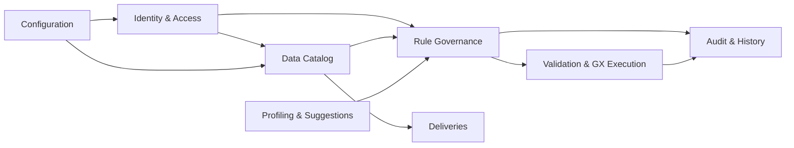

# dq-made-easy Conceptual Data Model

This document defines the conceptual data model for the platform. It is the highest-level contract in the database model stack: business concepts, domain boundaries, and the way those domains relate to each other.

## Contract

- The conceptual model talks about business concepts, not table names.
- Technical UUID7 identifiers are implementation details and stay out of the conceptual layer.
- Non-UI public APIs should expose business keys, not storage identifiers.
- The conceptual model should remain stable even if the physical schema is refactored.
- If a new domain concept appears, add it here before adding lower-level persistence detail.

## Concept Map

## Domain Boundaries

### Identity & Access

Workspace membership, users, roles, and exceptional access requests.

### Data Catalog

Data products, data sets, data objects, versioned schemas, attributes, and delivery metadata.

### Rule Governance

Rules, reusable filter and join assets, approvals, rule version history, and rollback events.

### Validation & GX Execution

Validation artifacts, GX suite registries, execution runs, run plans, run histories, and violations.

### Profiling & Suggestions

Data source metadata, profiling requests, generated suggestions, and user interactions with suggestions.

### Deliveries

Delivery records and delivery notes that record where delivered artifacts were stored and how they were produced.

### Audit & History

Status history, audit trails, and lifecycle transitions for governed entities.

### Configuration

Application configuration and system metadata required by the platform.

## Conceptual Relationships

- A workspace contains users, roles, catalog assets, rules, validation plans, and execution records.
- A data product contains data sets.
- A data set contains one or more data objects.
- A data object is realized through versioned schemas and attributes.
- Rules can be approved, versioned, validated, and executed.
- Validation and GX execution consume catalog and rule concepts, then produce run history and violations.
- Profiling produces suggestions that can later become rules.
- Deliveries describe produced outputs and the storage locations that hold them.

## Notes

- This document is the business-facing companion to the logical model and ERD.
- When a conceptual boundary changes, update the logical model and ERD in the same change set.
- If a concept is not stable enough to name here, it should not be promoted into a public contract yet.
