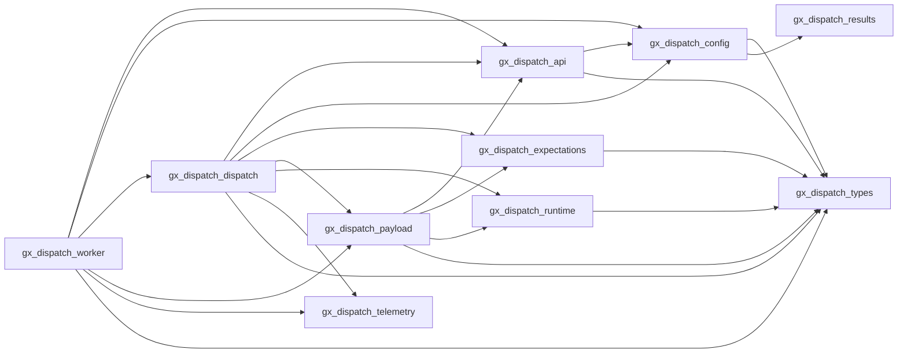

# DQ Engine — Module Architecture

> **Last updated:** 2026-07-05  
> **Scope:** `dq-engine/` Python service — GX dispatch worker, expectation evaluation, runtime management

## Overview

The **dq-engine** service is the data quality execution engine for DQ Made Easy. It consumes dispatch messages from a Redis queue, evaluates Great Expectations suites against Spark DataFrames, and reports outcomes back through the API (Kong → FastAPI → DB).

The engine follows the **Single Responsibility Principle (SRP)**: each module owns exactly one feature area. The worker entry point (`gx_dispatch_worker.py`) contains only the main loop, heartbeat, and crash recovery logic.

## Module Inventory

| Module | Lines | Responsibility |
|---|---|---|
| `gx_dispatch_config.py` | 272 | Configuration loading and environment variable resolution |
| `gx_dispatch_api.py` | 357 | Kong API client, run reporting, failure handling, exception helpers |
| `gx_dispatch_payload.py` | 283 | Dispatch payload parsing, source override extraction, suite envelope resolution |
| `gx_dispatch_dispatch.py` | 921 | Dispatch routing by execution shape (grouped / single / join-pair / spark expectations) |
| `gx_dispatch_expectations.py` | 830 | Expectation evaluation engine (native GX + custom) — single source of truth |
| `gx_dispatch_runtime.py` | 414 | Spark session management, S3/URI handling, source location resolution |
| `gx_dispatch_results.py` | 29 | Small utility helpers (e.g., UTC timestamp formatting) |
| `gx_dispatch_telemetry.py` | 431 | OpenTelemetry instrumentation, span recording, metric emission |
| `gx_dispatch_types.py` | 53 | Shared type definitions (`GxWorkerConfig`, `GxWorkerConfigError`, `GxWorkerExecutionError`) |
| `gx_dispatch_worker.py` | 291 | **Main entry point** — worker loop, heartbeat, crash recovery |
| `execution_dispatch.py` | 490 | Generic execution dispatch (non-GX engines, engine-agnostic routing) |
| **Total** | **3,881** | |

## Dependency Graph

**No circular imports.** The dependency chain is strictly acyclic and flows from types → config → api → payload → dispatch → worker.

## Module Responsibilities

### `gx_dispatch_types.py` — Shared Types

Defines the core data structures shared across all modules:

- `GxWorkerConfig` — dataclass holding all runtime configuration (Redis URL, queue keys, Spark master/port, S3 credentials, API URL, etc.)
- `GxWorkerConfigError` — configuration validation error
- `GxWorkerExecutionError` — runtime execution error with `failure_code` and `status_code`

### `gx_dispatch_config.py` — Configuration

Resolves all environment-based settings and bundles them into a `GxWorkerConfig`:

- Redis URL and queue key resolution
- Spark master and UI port
- S3 endpoint, credentials, region
- Kong API URL
- OIDC token provider construction
- Heartbeat TTL and interval

**Public entry point:** `load_config() → GxWorkerConfig`

### `gx_dispatch_api.py` — API Client

All HTTP communication with Kong / FastAPI:

- `_api_request()` — generic HTTP client with OIDC token injection
- `_api_get_suite_envelope()` — fetch GX suite definition from API
- `_api_get_data_object_version()` — fetch data object version metadata
- `_api_report_run()` — report run status (running/succeeded/failed)
- `_api_report_execution_progress()` — report progress updates
- `_report_dispatch_failure()` — structured failure reporting
- Exception coercion (`_coerce_reported_failure`, `_is_spark_runtime_exception`, `_should_fail_closed_worker`)

### `gx_dispatch_payload.py` — Payload Parsing

Dispatch message and source location resolution:

- `_parse_dispatch_payload()` — JSON parse of raw Redis messages
- `_assert_runnable_suite()` — validate suite envelope has executable expectations
- `_extract_source_overrides()` — extract source URI overrides from dispatch payload
- `_resolve_locations_for_targets()` — resolve source locations for all targets (API or override)
- `_resolve_join_pair_location()` — resolve join-pair materialization source
- `SourceLocation` — dataclass for URI + format + options

### `gx_dispatch_dispatch.py` — Dispatch Routing

Main routing engine that dispatches messages by `execution_shape`:

- `process_dispatch_message()` — **public entry point** for all dispatch messages
- `_process_grouped_dispatch_message()` — grouped scope execution (multiple suites across targets)
- `_process_spark_expectations_dispatch_message()` — generic engine execution (non-GX)
- `_build_spark_expectations_report_summary()` — summary builder for spark expectations

**Execution shapes:**
- `grouped_scope` — multiple suites, multiple targets, batched execution
- `single_object` — single suite, one or more data object version targets
- `join_pair` — single suite, joined source materialization
- `spark_expectations` — generic engine rule execution

### `gx_dispatch_expectations.py` — Expectation Evaluation

Single source of truth for all expectation evaluation logic:

- `_evaluate_expectations_spark()` — **public entry point** for Spark-based expectation evaluation
- `_NativeGxBatchRunner` — native Great Expectations execution (18 supported types)
- Row condition builders (`_build_spark_row_condition_expression`, `_lower_native_gx_row_condition`)
- Column extraction helpers (`_required_columns_for_expectation`, `_collect_row_condition_columns`)
- Alias mapping for column name rewriting (`_build_native_gx_alias_map`, `_rewrite_native_gx_expectation_for_aliases`)
- Row failure diagnostics (`_build_row_failure_diagnostics`, `_build_row_identifier`)

**Supported native GX expectation types:**
`expect_table_row_count_to_be_between`, `expect_compound_columns_to_be_unique`, `expect_column_values_to_not_be_null`, `expect_column_values_to_be_null`, `expect_column_values_to_be_in_set`, `expect_column_values_to_not_be_in_set`, `expect_column_values_to_be_between`, `expect_column_values_to_not_be_between`, `expect_column_values_to_match_regex`, `expect_column_values_to_not_match_regex`, `expect_column_values_to_be_unique`, `expect_column_pair_values_to_be_equal`, `expect_column_proportion_of_non_null_values_to_be_between`

### `gx_dispatch_runtime.py` — Spark & S3 Runtime

Spark session and storage management:

- `_create_spark_session()` / `_safe_stop_spark_session()` — Spark lifecycle
- `_configure_worker_spark_builder()` — Spark builder configuration
- S3/URI handling (`_normalize_s3_uri`, `_parse_s3a_uri`, `_assert_supported_uri`)
- Source location resolution (`_coerce_source_location`, `_infer_materialized_source_location`)
- Dataset reading (`_spark_read_dataset`)
- S3 prefix download to temp directory (`_download_s3a_prefix_to_tempdir`)

### `gx_dispatch_telemetry.py` — OpenTelemetry

Observability instrumentation:

- `configure_worker_telemetry()` — OTLP exporter setup
- `traced_worker_span()` — context manager for span recording
- `record_worker_duration()` — duration metrics
- `record_worker_expectation_results()` — expectation pass/fail counters
- `record_worker_failure()` — failure event recording
- `record_worker_heartbeat()` — heartbeat telemetry
- `record_spark_expectations_observability()` — spark-specific observability

### `gx_dispatch_worker.py` — Main Entry Point

Contains ONLY the worker lifecycle:

- `run_worker_forever()` — **main entry point** (also `__main__`)
- `_write_worker_heartbeat()` — write heartbeat to Redis
- `_start_worker_heartbeat_loop()` — background heartbeat thread

**Worker loop flow:**
1. Load config → validate token → connect to Redis
2. Crash recovery: requeue stuck messages from processing queue
3. Main loop: `BRPOPLUSH` from queue → `process_dispatch_message()` → remove from processing queue
4. Error handling: report failure → discard or requeue → fail-closed on fatal Spark errors

## Kafka Consumer

The **`dq-kafka-consumer`** is a separate, lightweight Python container that consumes violation records from Kafka and persists them to both the database and S3. It is NOT part of the Spark-heavy `dq-engine` image.

| File | Purpose |
|---|---|
| `dq-kafka-consumer/Dockerfile.kafka-consumer` | Container build |
| `dq-kafka-consumer/kafka_consumer_worker.py` | Kafka consumer worker |
| `dq-kafka-consumer/requirements.txt` | Dependencies (lightweight, no Spark) |

The consumer is defined as the `kafka-consumer` service in `docker-compose.yml` under the `workers` profile.

## File History

| Date | Change |
|---|---|
| 2026-07-05 | Module split from monolithic `gx_dispatch_worker.py` (2,832 → 291 lines). Created `gx_dispatch_config.py`, `gx_dispatch_api.py`, `gx_dispatch_payload.py`, `gx_dispatch_dispatch.py`. Added `dq-kafka-consumer`. |

## Related Documentation

- [Refactoring Plan](../implementation-details/refactor-gx-dispatch-modules.md) — detailed action plan and risk assessment
- [Spark Expectations Engine Plan](../implementation-details/SPARK_EXPECTATIONS_ENGINE_PLAN.md) — expectation evaluation architecture
- [Execution Abstraction](../implementation-details/ABS_1_EXECUTION_ABSTRACTION_IMPLEMENTATION_DETAILS.md) — multi-runtime execution abstraction
- [Observability Quickstart](../implementation-details/OBSERVABILITY_QUICKSTART.md) — OTLP/telemetry setup
