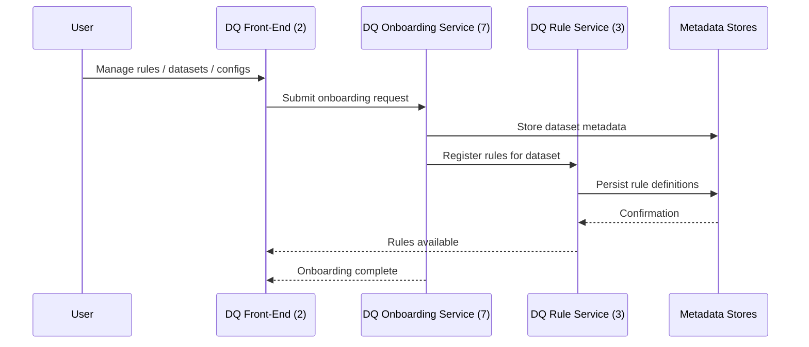

# User Intreaction Flow

SVG asset: [user-interaction-flow.svg](https://github.com/jactools/dq-rulebuilder/blob/main/docs/flows/user-interaction-flow.svg)

```mermaid

sequenceDiagram
    participant User
    participant FE as DQ Front-End (2)
    participant Onboard as DQ Onboarding Service (7)
    participant Rule as DQ Rule Service (3)
    participant Meta as Metadata Stores

    User->>FE: Manage rules / datasets / configs
    FE->>Onboard: Submit onboarding request

    Onboard->>Meta: Store dataset metadata
    Onboard->>Rule: Register rules for dataset

    Rule->>Meta: Persist rule definitions
    Meta-->>Rule: Confirmation

    Rule-->>FE: Rules available
    Onboard-->>FE: Onboarding complete
```