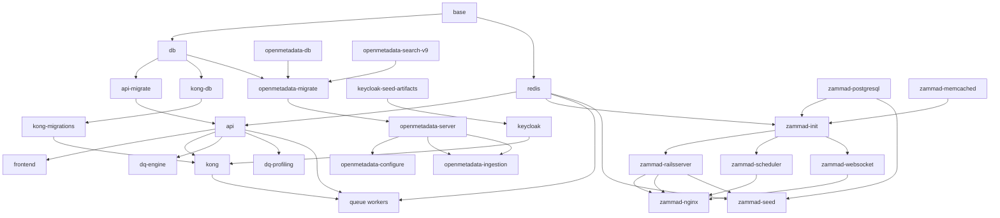

# Stack Script Contract

Last updated: 2026-05-09

## Purpose

This document records the current operator contract for the stack scripts in `scripts/`. It covers the canonical command entrypoints, the shared shell helpers they depend on, and the service dependency shape that governs startup, teardown, seed, reconcile, smoke, and validation flows.

## Canonical Env Contract

All stack lifecycle entrypoints use the same env selection contract:

```bash
--env dev
--env test
--env prod
--env-file PATH
```

The canonical named env files are:

- `dev` -> `.env.dev.local`
- `test` -> `.env.test.local`
- `prod` -> `.env.prod.local`

`--env-file PATH` remains the explicit escape hatch for CI, `/etc`, and diagnostics.

## Command Surface

| Script | Responsibility | Contract Notes |
| --- | --- | --- |
| [scripts/stack_ctl.sh](https://github.com/jactools/dq-rulebuilder/blob/main/scripts/stack_ctl.sh) | Unified operator entrypoint for build, pull, push, start, restart, stop, reconcile, seed, and list-targets. | Uses canonical env selection and dependency planning. `stop` now uses the shared teardown helpers so service shutdown follows the dependency graph. |
| [scripts/stack_status.sh](https://github.com/jactools/dq-rulebuilder/blob/main/scripts/stack_status.sh) | Status reporter for compose services resolved from profiles and explicit services. | Uses the canonical env selection contract, resolves the same dependency-ordered service set as the lifecycle scripts, and reports grouped service status by default with `--per-container` for detailed container-level output. |
| [scripts/start_stack.sh](https://github.com/jactools/dq-rulebuilder/blob/main/scripts/start_stack.sh) | Compose startup entrypoint for runtime profiles. | Slices startup into named startup blocks under `scripts/startup/`. It does not perform seed or smoke work. |
| [scripts/stop_stack.sh](https://github.com/jactools/dq-rulebuilder/blob/main/scripts/stop_stack.sh) | Full-stack teardown wrapper with optional volume removal. | Delegates service shutdown to `stack_ctl.sh stop --all` and then handles `compose down` / volume cleanup. |
| [scripts/stop-all.sh](https://github.com/jactools/dq-rulebuilder/blob/main/scripts/stop-all.sh) | Stops the local frontend and then the stack. | Wrapper around `stop_stack.sh` for operator convenience. |
| [scripts/seed_stack.sh](https://github.com/jactools/dq-rulebuilder/blob/main/scripts/seed_stack.sh) | Seed entrypoint for runtime seed actions. | Dispatches dedicated seed blocks under `scripts/seeding/`. |
| [scripts/start_stack_pull.sh](https://github.com/jactools/dq-rulebuilder/blob/main/scripts/start_stack_pull.sh) | Pulls repo-managed images before startup. | Uses the same env contract and seed helpers as the main lifecycle scripts. |
| [scripts/reconcile_stack.sh](https://github.com/jactools/dq-rulebuilder/blob/main/scripts/reconcile_stack.sh) | Post-start reconciliation entrypoint. | Runs explicit Kong, Keycloak, and OpenMetadata reconciliation actions outside startup. |
| [scripts/smoke_stack.sh](https://github.com/jactools/dq-rulebuilder/blob/main/scripts/smoke_stack.sh) | Explicit smoke follow-up wrapper. | Delegates to [scripts/validation/stack_smoke.sh](https://github.com/jactools/dq-rulebuilder/blob/main/scripts/validation/stack_smoke.sh); smoke checks are not part of startup or teardown. |
| [scripts/validate.sh](https://github.com/jactools/dq-rulebuilder/blob/main/scripts/validate.sh) | Validation runner for repo checks. | Validation scripts assume the stack is already running when they need it; they do not bring services up. |

## Shared Helpers

| Helper | Responsibility |
| --- | --- |
| [scripts/supporting/logging.sh](https://github.com/jactools/dq-rulebuilder/blob/main/scripts/supporting/logging.sh) and [scripts/supporting/logging/core.sh](https://github.com/jactools/dq-rulebuilder/blob/main/scripts/supporting/logging/core.sh) | Canonical logging entrypoint and logging implementation. |
| [scripts/supporting/env/selection.sh](https://github.com/jactools/dq-rulebuilder/blob/main/scripts/supporting/env/selection.sh) | Canonical `--env` / `--env-file` parsing, env-file resolution, and validation dispatch. |
| [scripts/supporting/compose/invocation.sh](https://github.com/jactools/dq-rulebuilder/blob/main/scripts/supporting/compose/invocation.sh) | Canonical `docker compose` wrapper bound to the selected env file. |
| [scripts/supporting/stay_awake.sh](https://github.com/jactools/dq-rulebuilder/blob/main/scripts/supporting/stay_awake.sh) | macOS display-awake helper used by long-running operator scripts. | Uses `caffeinate` when available, can be sourced by other scripts, and can also be run directly with `--duration` plus an optional arrow-key press to keep the screen awake for a fixed time. |
| [scripts/supporting/auth.sh](https://github.com/jactools/dq-rulebuilder/blob/main/scripts/supporting/auth.sh) | Seeded credential loading and Keycloak password-grant token minting. |
| [scripts/supporting/readiness.sh](https://github.com/jactools/dq-rulebuilder/blob/main/scripts/supporting/readiness.sh) | HTTP, Kong, Zammad, and database readiness helpers. |
| [scripts/supporting/dependency_planning.sh](https://github.com/jactools/dq-rulebuilder/blob/main/scripts/supporting/dependency_planning.sh) | Dependency closure planning and runtime health validation. |
| [scripts/supporting/teardown.sh](https://github.com/jactools/dq-rulebuilder/blob/main/scripts/supporting/teardown.sh) | Shared teardown target collection and stop execution helpers. |
| [scripts/stack_catalog.sh](https://github.com/jactools/dq-rulebuilder/blob/main/scripts/stack_catalog.sh) | Canonical lists for runtime profiles, repo-managed images, and seed targets. |

## Dependency Graph Summary

The exhaustive service-level dependency list lives in [STACK_SERVICE_DEPENDENCY_MANIFEST.md](/docs/implementation-details/STACK_SERVICE_DEPENDENCY_MANIFEST/). The summary below is the operator-facing shape used by the scripts.




### Stop Order Contract

Stop order is the reverse of the dependency graph. The shared teardown helper resolves selected profiles and/or services into an ordered stop list, validates that the selected services are running, and then stops them in reverse dependency order.

That means shared dependencies stop after their consumers, for example:

- `frontend` stops before `api`
- `api` stops before `db` and `redis`
- `kong` stops before `kong-db`, `api`, and `keycloak`
- `openmetadata-ingestion` stops before `openmetadata-server`
- `openmetadata-server` stops before `openmetadata-db` and `openmetadata-search-v9`
- `zammad-nginx` stops before `zammad-railsserver`, `zammad-scheduler`, and `zammad-websocket`
- `zammad-*` application services stop before `zammad-postgresql`, `redis`, and `zammad-memcached`

## Unchanged Flows

- The mock-data CSV to SQL conversion pipeline remains unchanged.
- Validation and smoke scripts do not start the stack; they assume the required services are already up and fail fast if they are not.
- No compatibility shims or legacy selector aliases are introduced.

## See Also

- [STACK_SCRIPT_MODULARIZATION_WORK_PLAN.md](/docs/implementation-details/STACK_SCRIPT_MODULARIZATION_WORK_PLAN/)
- [STACK_SHARED_SHELL_PRIMITIVES_PLAN.md](/docs/implementation-details/STACK_SHARED_SHELL_PRIMITIVES_PLAN/)
- [STACK_SERVICE_DEPENDENCY_MANIFEST.md](/docs/implementation-details/STACK_SERVICE_DEPENDENCY_MANIFEST/)
