# dq-made-easy Database ERD

This ERD is the physical schema layer for the platform. It is reconstructed from the live SQLAlchemy ORM models and generated seed data.

For the logical and conceptual layers, see [DATABASE_LDM.md](/docs/technical/DATABASE_LDM/) and [DATABASE_CDM.md](/docs/technical/DATABASE_CDM/).

ODCS belongs above this layer. It defines product-level delivery and quality contracts, while this ERD records the physical tables that realize the platform model.

## Table Classification Registry

Table-level classification is a physical-schema shorthand. Element-level definitions and BDE/CDE labels live in [DATABASE_LDM_DEFINITIONS.md](/docs/technical/DATABASE_LDM_DEFINITIONS/).

| Table | Class | Notes |
| --- | --- | --- |
| `workspaces` | CDE | Core workspace identity table. |
| `users` | CDE | Core user identity table. |
| `roles` | CDE | Core role identity table. |
| `user_roles` | BDE | User-to-role assignment bridge. |
| `exception_fact_access_requests` | BDE | Access-request workflow table. |
| `data_products` | CDE | Canonical product registry. |
| `data_sets` | CDE | Canonical dataset registry. |
| `data_objects` | CDE | Canonical object registry. |
| `data_objects_catalog` | CDE | Catalog identity registry for data objects. |
| `data_object_versions` | CDE | Versioned schema registry for data objects. |
| `attributes_catalog` | CDE | Canonical attribute registry. |
| `attribute_definition_mappings` | BDE | Attribute-to-definition mapping bridge. |
| `data_deliveries` | CDE | Delivery registry for materialized outputs. |
| `data_delivery_notes` | CDE | Delivery read model and note record. |
| `rules` | CDE | Core rule registry. |
| `reusable_filters` | CDE | Reusable filter registry. |
| `reusable_joins` | CDE | Reusable join registry. |
| `rule_reusable_filters` | BDE | Rule-to-filter mapping bridge. |
| `rule_attributes` | BDE | Rule-to-attribute association table. |
| `approvals` | CDE | Governance approval registry. |
| `audit` | BDE | Audit trail for approvals. |
| `test_proofs` | CDE | Validation proof registry. |
| `batch_test_requests` | BDE | Batch test workflow table. |
| `app_config` | BDE | Application configuration table. |
| `sessions` | BDE | Authentication session table. |
| `system_info` | BDE | System metadata and version table. |
| `data_source_metadata` | CDE | Source-system metadata registry. |
| `data_source_profiling_requests` | BDE | Profiling request workflow table. |
| `suggestions` | CDE | Generated suggestion registry. |
| `suggestion_interactions` | BDE | Suggestion interaction table. |
| `validation_runs` | CDE | Validation run registry. |
| `validation_run_items` | BDE | Per-rule validation result table. |
| `validation_artifact_registry` | CDE | Validation artifact registry. |
| `validation_artifact_status_history` | BDE | Validation artifact lifecycle history. |
| `suggestion_preview_interactions` | BDE | Preview interaction workflow table. |
| `rule_versions` | CDE | Versioned rule definition registry. |
| `rule_current_versions` | BDE | Rule-to-current-version pointer table. |
| `rule_version_diffs` | BDE | Version comparison history table. |
| `rule_rollbacks` | BDE | Rule rollback history table. |
| `rule_status_history` | BDE | Rule lifecycle history table. |
| `rule_version_relationships` | BDE | Rule-version linkage table. |
| `rule_version_compiler_artifacts` | BDE | Rule compiler artifact table. |
| `gx_suite_registry` | CDE | GX suite registry. |
| `gx_suite_execution_target_map` | BDE | Suite-to-target mapping table. |
| `gx_suite_rule_map` | BDE | Suite-to-rule mapping table. |
| `gx_suite_status_history` | BDE | GX suite lifecycle history table. |
| `gx_run_plans` | CDE | GX run-plan registry. |
| `gx_run_plan_versions` | CDE | GX run-plan version registry. |
| `gx_run_plan_transitions` | BDE | GX run-plan transition history table. |
| `gx_execution_runs` | CDE | GX execution run registry. |
| `gx_execution_run_status_history` | BDE | GX execution lifecycle history table. |
| `gx_execution_violations` | BDE | GX violation detail table. |
| `validation_run_plans` | CDE | Validation run-plan registry. |
| `validation_run_plan_versions` | CDE | Validation run-plan version registry. |
| `validation_run_plan_transitions` | BDE | Validation run-plan transition history table. |

## Core schema

```mermaid
erDiagram
    workspaces {
        text id PK
        text name
        text description
    }

    users {
        text id PK
        text name
        text email
        text workspaces
        text preferences
        text external_id
    }

    roles {
        text id PK
        text name
        text workspace
        text permissions
    }

    user_roles {
        text user_id PK, FK
        text role_id PK, FK
    }

    exception_fact_access_requests {
        text id PK
        text requester_id FK
        text workspace_id
        text role_id FK
        text status
    }

    data_products {
        text id PK
        text business_key
        text name
        text workspace_id
        text odcs_data_product_id
    }

    data_sets {
        text id PK
        text product_id FK
        text business_key
        text name
        text workspace_id
    }

    data_objects {
        text id PK
        text business_key
        text name
        text workspace
    }

    data_objects_catalog {
        text id PK
        text dataset_id FK
        text business_key
        text name
        text latest_version_id
    }

    data_object_versions {
        text id PK
        text data_object_id FK
        int version
        text schema_hash
        int attribute_count
    }

    attributes_catalog {
        text id PK
        text data_object_id FK
        text version_id FK
        text name
        text type
        bool is_business_key
    }

    attribute_definition_mappings {
        text id PK
        text attribute_id FK
        text definition_id
        text mapping_state
    }

    data_deliveries {
        text id PK
        text data_object_id FK
        text data_object_version_id FK
        int version
        text layer
        text delivery_location
    }

    data_delivery_notes {
        text data_delivery_id PK, FK
        text storage_location
        text delivery_format
        text source_system
    }

    rules {
        text id PK
        text workspace
        text createdby
        text suggestion_id
        text reusable_join_id
        text template_id
    }

    reusable_filters {
        text id PK
        text workspace
        text created_by
    }

    rule_reusable_filters {
        text rule_id PK, FK
        text reusable_filter_id PK, FK
    }

    reusable_joins {
        text id PK
        text workspace
        text created_by
    }

    rule_attributes {
        text id PK
        text ruleid
        text attributeid
        numeric threshold_override
    }

    approvals {
        text id PK
        text business_key
        text ruleid
        text approvalid
        text requesterid
        text workspace
    }

    audit {
        text id PK
        text approvalid FK
        text actorid
    }

    test_proofs {
        text id PK
        text ruleid
        text workspace
    }

    batch_test_requests {
        text id PK
        text ruleid FK
        text proof_id FK
        text workspace
    }

    app_config {
        text config_key PK
        text value_type
    }

    sessions {
        text id PK
        text user_id
        text access_token
    }

    system_info {
        text info_key PK
        text info_value
    }

    data_source_metadata {
        text id PK
        text data_source_id UK
        text profiled_by_user_id
    }

    data_source_profiling_requests {
        text id PK
        text data_source_id FK
        text requested_by_user_id FK
    }

    suggestions {
        text id PK
        text user_id FK
        text data_source_id
        text created_from_profiling_request_id FK
    }

    suggestion_interactions {
        text id PK
        text suggestion_id FK
        text user_id FK
        text rule_created_from_suggestion_id
    }

    validation_runs {
        text id PK
        text workspace
        text triggered_by
    }

    validation_run_items {
        text id PK
        text run_id FK
        text rule_id
    }

    validation_artifact_registry {
        text id PK
        text validation_artifact_id
        int validation_artifact_version
        text engine_type
        text status
    }

    validation_artifact_status_history {
        text id PK
        text validation_artifact_id FK
        int validation_artifact_version FK
        text from_status
        text to_status
    }

    suggestion_preview_interactions {
        text id PK
        text user_id FK
        text workspace_id
        text action
        text result
    }

    data_products ||--o{ data_sets : contains
    data_sets ||--o{ data_objects_catalog : contains
    data_objects_catalog ||--o{ data_object_versions : versions
    data_objects_catalog ||--o{ attributes_catalog : attributes
    data_object_versions ||--o{ attributes_catalog : version_attributes
    data_objects_catalog ||--o{ data_deliveries : deliveries

    users ||--o{ user_roles : assigned
    roles ||--o{ user_roles : grants

    rules ||--o{ rule_reusable_filters : maps
    reusable_filters ||--o{ rule_reusable_filters : used_by

    approvals ||--o{ audit : audit_entries

    rules ||--o{ batch_test_requests : batch_requests
    test_proofs ||--o{ batch_test_requests : proof_links

    users ||--o{ data_source_profiling_requests : requested_by
    data_source_metadata ||--o{ data_source_profiling_requests : profiles
    data_source_profiling_requests ||--o{ suggestions : seeds
    users ||--o{ suggestions : suggests
    suggestions ||--o{ suggestion_interactions : interactions
    users ||--o{ suggestion_interactions : actions

    validation_runs ||--o{ validation_run_items : items
    validation_artifact_registry ||--o{ validation_artifact_status_history : status_history
    users ||--o{ exception_fact_access_requests : requests
    roles ||--o{ exception_fact_access_requests : targets
    data_deliveries ||--o{ data_delivery_notes : notes
    data_object_versions ||--o{ data_deliveries : versioned_deliveries
    attributes_catalog ||--o{ attribute_definition_mappings : definition_mappings
    users ||--o{ suggestion_preview_interactions : previews
```

## Rules, versioning, and GX runtime

```mermaid
erDiagram
    rules {
        text id PK
        text current_version_id
        int total_versions
        bool versioning_enabled
    }

    rule_versions {
        text id PK
        text rule_id FK
        int version_number
        text created_by
    }

    rule_current_versions {
        text rule_id PK, FK
        text version_id FK
    }

    rule_version_diffs {
        text id PK
        text from_version_id FK
        text to_version_id FK
        text field_name
    }

    rule_rollbacks {
        text id PK
        text rule_id FK
        text from_version_id FK
        text to_version_id FK
        text new_version_created_id FK
    }

    rule_status_history {
        text id PK
        text rule_id FK
        text from_status
        text to_status
    }

    rule_version_relationships {
        text id PK
        text version_id FK
        text approval_id FK
        text test_proof_id FK
        text deployment_id
    }

    rule_version_compiler_artifacts {
        text id PK
        text rule_version_id FK
        text artifact_key
        text compile_status
    }

    gx_suite_registry {
        text id PK
        text suite_id
        int suite_version
        text status
    }

    gx_suite_execution_target_map {
        text id PK
        text suite_id FK
        int suite_version FK
        text data_object_version_id
    }

    gx_suite_rule_map {
        text id PK
        text suite_id FK
        int suite_version FK
        text rule_id
    }

    gx_suite_status_history {
        text id PK
        text suite_id
        int suite_version
        text from_status
        text to_status
    }

    gx_run_plans {
        text id PK
        text workspace_id
        text business_key
        text current_active_version_id
        text status
    }

    gx_run_plan_versions {
        text id PK
        text run_plan_id FK
        text suite_id
        int suite_version
        text supersedes_version_id
    }

    gx_run_plan_transitions {
        text id PK
        text run_plan_id FK
        text run_plan_version_id FK
        text action
    }

    gx_execution_runs {
        text id PK
        text suite_id
        int suite_version
        text rule_id
        text rule_version_id
        text correlation_id
    }

    gx_execution_run_status_history {
        text id PK
        text run_id FK
        text from_status
        text to_status
    }

    gx_execution_violations {
        text data_object_version_id PK
        text id PK
        text execution_run_id FK
        text suite_id
        int suite_version
        text rule_id
        text rule_version_id
    }

    validation_run_plans {
        text id PK
        text workspace_id
        text business_key
        text current_active_version_id
        text status
    }

    validation_run_plan_versions {
        text id PK
        text run_plan_id FK
        text artifact_id
        int artifact_version
        text supersedes_version_id
    }

    validation_run_plan_transitions {
        text id PK
        text run_plan_id FK
        text run_plan_version_id FK
        text action
    }

    rules ||--o{ rule_versions : snapshots
    rules ||--o{ rule_current_versions : current_pointer
    rule_versions ||--o{ rule_current_versions : selected_version
    rule_versions ||--o{ rule_version_diffs : from_version
    rule_versions ||--o{ rule_version_diffs : to_version
    rules ||--o{ rule_rollbacks : rollback_history
    rule_versions ||--o{ rule_rollbacks : from_version
    rule_versions ||--o{ rule_rollbacks : to_version
    rule_versions ||--o{ rule_rollbacks : replacement_version
    rules ||--o{ rule_status_history : status_history
    rule_versions ||--o{ rule_version_relationships : linked_version
    approvals ||--o{ rule_version_relationships : approval
    test_proofs ||--o{ rule_version_relationships : proof
    rule_versions ||--o{ rule_version_compiler_artifacts : artifacts

    gx_suite_registry ||--o{ gx_suite_execution_target_map : target_map
    gx_suite_registry ||--o{ gx_suite_rule_map : rule_map
    gx_suite_registry ||--o{ gx_suite_status_history : lifecycle

    gx_run_plans ||--o{ gx_run_plan_versions : versions
    gx_run_plans ||--o{ gx_run_plan_transitions : transitions
    gx_run_plan_versions ||--o{ gx_run_plan_transitions : version_transitions

    gx_execution_runs ||--o{ gx_execution_run_status_history : run_history
    gx_execution_runs ||--o{ gx_execution_violations : violations
    validation_run_plans ||--o{ validation_run_plan_versions : versions
    validation_run_plans ||--o{ validation_run_plan_transitions : transitions
    validation_run_plan_versions ||--o{ validation_run_plan_transitions : version_transitions
```

## Notes

- Some tables store logical references as raw IDs without a declared foreign key, so the ERD only draws enforced relationships.
- The live database includes a few undocumented column migrations, such as `approvals.workspace_id` and `users.external_id`.
