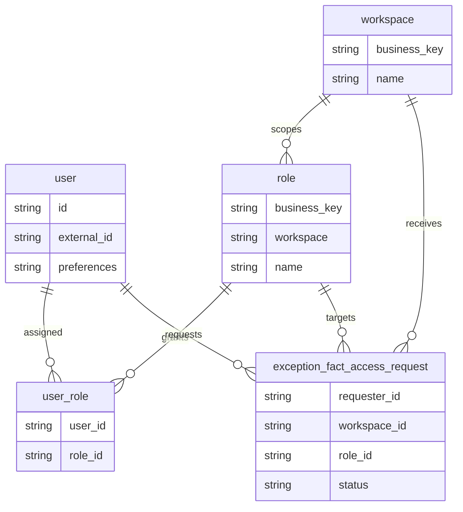
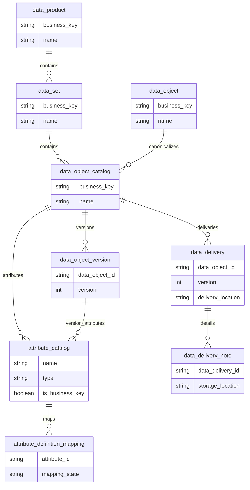
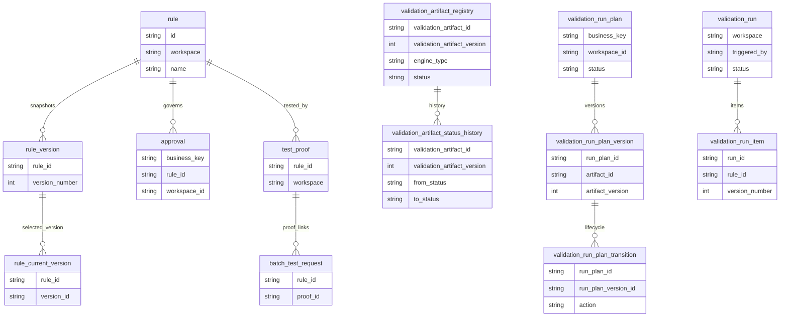
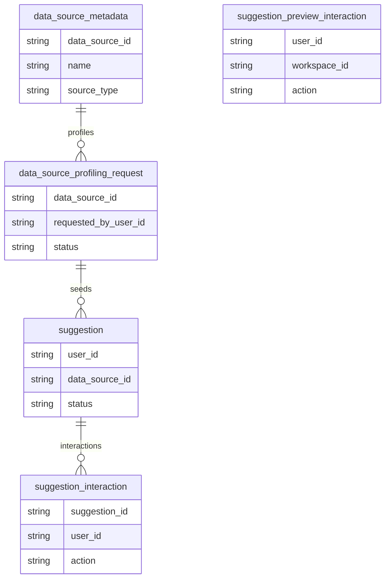

# dq-made-easy Logical Data Model

This document defines the normalized logical data model for the platform. It is the contract for entity names, business keys, and cardinalities. It intentionally omits Postgres-specific storage details, indexes, and generated artifacts.

For full entity and element definitions, including BDE/CDE classification, see [DATABASE_LDM_DEFINITIONS.md](/docs/technical/DATABASE_LDM_DEFINITIONS/).

ODCS belongs above this layer: it governs product-level delivery and quality contracts, while this logical model governs the semantic entities and data elements that those contracts refer to.

## Contract

- Technical UUID7 identifiers remain internal persistence keys.
- Non-UI public APIs use business keys from [BUSINESS_KEYS.md](/docs/features/BUSINESS_KEYS/).
- Logical entities are modeled independently from physical table names.
- Versioned domains keep current pointers and history records separate.
- If a logical relationship changes, update the ERD and this document together.
- Use the companion definition appendix as the source of truth for BDE/CDE classification.

## Identity and Access

## Data Catalog

## Governance and Validation

## Profiling and Suggestions

## Notes

- The logical model is intentionally broader than the ERD table set. It captures entity families, business keys, and stable relationships, not storage mechanics.
- When a logical entity gets a new public lookup path, update [BUSINESS_KEYS.md](/docs/features/BUSINESS_KEYS/) at the same time.
- If a table is added to the physical schema, the logical model should be checked for the matching business entity and relationship.
- The detailed entity and element registry lives in [DATABASE_LDM_DEFINITIONS.md](/docs/technical/DATABASE_LDM_DEFINITIONS/).
