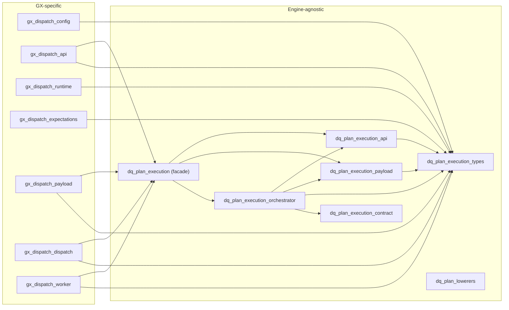

# DQ Engine — Module Architecture

> **Last updated:** 2026-07-05  
> **Scope:** `dq-engine/` Python service — GX dispatch worker, expectation evaluation, runtime management, multi-engine dispatch

## Overview

The **dq-engine** service is the data quality execution engine for DQ Made Easy. It consumes dispatch messages from a Redis queue, evaluates Great Expectations suites against Spark DataFrames, and reports outcomes back through the API (Kong → FastAPI → DB).

The engine follows the **Single Responsibility Principle (SRP)**: each module owns exactly one feature area. The worker entry point (`gx_dispatch_worker.py`) contains only the main loop, heartbeat, and crash recovery logic.

## Architecture Layers

The engine is split into two concerns:

1. **GX-specific modules** (`gx_dispatch_*`) — own the GX worker, its config, API reporting, and expectation evaluation. These import from shared `dq_plan_*` modules but never the reverse.
2. **Engine-agnostic modules** (`dq_plan_*`) — own the execution dispatch, rule lowering, and contract logic shared across all runtime engines (GX, Trino, Spark Expectations, Soda).

This enforces a strict one-way dependency: `gx_dispatch_*` → `dq_plan_*`, never the reverse.

## Module Inventory

### GX-specific modules (`gx_dispatch_*`)

| Module | Lines | Responsibility |
|---|---|---|
| `gx_dispatch_config.py` | 272 | Configuration loading and environment variable resolution |
| `gx_dispatch_api.py` | 357 | Kong API client, run reporting, failure handling, exception helpers |
| `gx_dispatch_payload.py` | 283 | Dispatch payload parsing, source override extraction, suite envelope resolution |
| `gx_dispatch_dispatch.py` | 921 | Dispatch routing by execution shape (grouped / single / join-pair / spark expectations) |
| `gx_dispatch_expectations.py` | 830 | Expectation evaluation engine (native GX + custom) — single source of truth |
| `gx_dispatch_runtime.py` | 414 | Spark session management, S3/URI handling, source location resolution |
| `gx_dispatch_results.py` | 29 | Small utility helpers (e.g., UTC timestamp formatting) |
| `gx_dispatch_telemetry.py` | 431 | OpenTelemetry instrumentation, span recording, metric emission |
| `gx_dispatch_worker.py` | 291 | **Main entry point** — worker loop, heartbeat, crash recovery |

### Engine-agnostic execution modules (`dq_plan_execution*`)

| Module | Lines | Responsibility |
|---|---|---|
| `dq_plan_execution_types.py` | 83 | Shared types (`DqWorkerConfig`, `DqWorkerConfigError`, `DqWorkerExecutionError`, `SourceLocation`) |
| `dq_plan_execution_payload.py` | 71 | Payload parsing, coercion, engine normalization |
| `dq_plan_execution_api.py` | 126 | HTTP request helpers, token provider, progress envelope |
| `dq_plan_execution_orchestrator.py` | 313 | Execution dispatch loop, report envelope building, failure handling |
| `dq_plan_execution_contract.py` | 62 | Execution metadata, observability summary (no I/O) |
| `dq_plan_execution_report.py` | 134 | Run reporting (`report_run`, `report_execution_progress`) |
| `dq_plan_execution_persistence.py` | 59 | File I/O (`persist_execution_payload`) |
| `dq_plan_execution_streaming.py` | 32 | Kafka violation publishing |
| `dq_plan_execution.py` | 87 | **Public facade** — re-exports from the nine modules above |

### Engine-agnostic lowerer modules (`dq_plan_lowerers*`)

| Module | Lines | Responsibility |
|---|---|---|
| `dq_plan_lowerers.py` | 341 | Lowerer registry, engine normalization, failure envelopes, compilation dispatch |
| `dq_plan_lowerers_gx.py` | 25 | GX-specific rule lowering |
| `dq_plan_lowerers_trino.py` | 33 | Trino-specific rule lowering |
| `dq_plan_lowerers_soda.py` | 16 | Soda rule lowering (stub — not implemented) |

### Engine-specific adapter modules

| Module | Lines | Responsibility |
|---|---|---|
| `spark_expectations_execution_adapter.py` | 989 | Spark Expectations adapter (rule lowering, execution, metrics) |
| `trino_execution_adapter.py` | 385 | Trino adapter (rule lowering, execution, artifact persistence) |

### Legacy modules removed

| Module | Replaced by |
|---|---|
| ~~`execution_dispatch.py`~~ (490) | `dq_plan_execution_payload.py` + `dq_plan_execution_api.py` + `dq_plan_execution_orchestrator.py` |
| ~~`execution_contract.py`~~ | `dq_plan_execution_contract.py` |
| ~~`runtime_lowerers.py`~~ (271) | `dq_plan_lowerers.py` + `dq_plan_lowerers_gx.py` + `dq_plan_lowerers_trino.py` + `dq_plan_lowerers_soda.py` |
| ~~`spark_expectations_adapter.py`~~ | `spark_expectations_execution_adapter.py` (renamed) |
| ~~`trino_execution_pipeline.py`~~ | `trino_execution_adapter.py` (renamed) |

## Dependency Graph

### GX Dispatch Chain (`gx_dispatch_*`)

**No circular imports.** The dependency chain is strictly acyclic. All `gx_dispatch_*` modules import from `dq_plan_execution*` and `dq_plan_execution_types`, never the reverse.

## Module Responsibilities

### `gx_dispatch_types.py` — Shared Types

Defines the core data structures shared across all modules:

- `GxWorkerConfig` — dataclass holding all runtime configuration (Redis URL, queue keys, Spark master/port, S3 credentials, API URL, etc.)
- `GxWorkerConfigError` — configuration validation error
- `GxWorkerExecutionError` — runtime execution error with `failure_code` and `status_code`

### `gx_dispatch_config.py` — Configuration

Resolves all environment-based settings and bundles them into a `GxWorkerConfig`:

- Redis URL and queue key resolution
- Spark master and UI port
- S3 endpoint, credentials, region
- Kong API URL
- OIDC token provider construction
- Heartbeat TTL and interval

**Public entry point:** `load_config() → GxWorkerConfig`

### `gx_dispatch_api.py` — API Client

All HTTP communication with Kong / FastAPI:

- `_api_request()` — generic HTTP client with OIDC token injection
- `_api_get_suite_envelope()` — fetch GX suite definition from API
- `_api_get_data_object_version()` — fetch data object version metadata
- `_api_report_run()` — report run status (running/succeeded/failed)
- `_api_report_execution_progress()` — report progress updates
- `_report_dispatch_failure()` — structured failure reporting
- Exception coercion (`_coerce_reported_failure`, `_is_spark_runtime_exception`, `_should_fail_closed_worker`)

### `gx_dispatch_payload.py` — Payload Parsing

Dispatch message and source location resolution:

- `_parse_dispatch_payload()` — JSON parse of raw Redis messages
- `_assert_runnable_suite()` — validate suite envelope has executable expectations
- `_extract_source_overrides()` — extract source URI overrides from dispatch payload
- `_resolve_locations_for_targets()` — resolve source locations for all targets (API or override)
- `_resolve_join_pair_location()` — resolve join-pair materialization source
- `SourceLocation` — dataclass for URI + format + options

### `gx_dispatch_dispatch.py` — Dispatch Routing

Main routing engine that dispatches messages by `execution_shape`:

- `process_dispatch_message()` — **public entry point** for all dispatch messages
- `_process_grouped_dispatch_message()` — grouped scope execution (multiple suites across targets)
- `_process_spark_expectations_dispatch_message()` — generic engine execution (non-GX)
- `_build_spark_expectations_report_summary()` — summary builder for spark expectations

**Execution shapes:**
- `grouped_scope` — multiple suites, multiple targets, batched execution
- `single_object` — single suite, one or more data object version targets
- `join_pair` — single suite, joined source materialization
- `spark_expectations` — generic engine rule execution

### `gx_dispatch_expectations.py` — Expectation Evaluation

Single source of truth for all expectation evaluation logic:

- `_evaluate_expectations_spark()` — **public entry point** for Spark-based expectation evaluation
- `_NativeGxBatchRunner` — native Great Expectations execution (18 supported types)
- Row condition builders (`_build_spark_row_condition_expression`, `_lower_native_gx_row_condition`)
- Column extraction helpers (`_required_columns_for_expectation`, `_collect_row_condition_columns`)
- Alias mapping for column name rewriting (`_build_native_gx_alias_map`, `_rewrite_native_gx_expectation_for_aliases`)
- Row failure diagnostics (`_build_row_failure_diagnostics`, `_build_row_identifier`)

**Supported native GX expectation types:**
`expect_table_row_count_to_be_between`, `expect_compound_columns_to_be_unique`, `expect_column_values_to_not_be_null`, `expect_column_values_to_be_null`, `expect_column_values_to_be_in_set`, `expect_column_values_to_not_be_in_set`, `expect_column_values_to_be_between`, `expect_column_values_to_not_be_between`, `expect_column_values_to_match_regex`, `expect_column_values_to_not_match_regex`, `expect_column_values_to_be_unique`, `expect_column_pair_values_to_be_equal`, `expect_column_proportion_of_non_null_values_to_be_between`

### `gx_dispatch_runtime.py` — Spark & S3 Runtime

Spark session and storage management:

- `_create_spark_session()` / `_safe_stop_spark_session()` — Spark lifecycle
- `_configure_worker_spark_builder()` — Spark builder configuration
- S3/URI handling (`_normalize_s3_uri`, `_parse_s3a_uri`, `_assert_supported_uri`)
- Source location resolution (`_coerce_source_location`, `_infer_materialized_source_location`)
- Dataset reading (`_spark_read_dataset`)
- S3 prefix download to temp directory (`_download_s3a_prefix_to_tempdir`)

### `gx_dispatch_telemetry.py` — OpenTelemetry

Observability instrumentation:

- `configure_worker_telemetry()` — OTLP exporter setup
- `traced_worker_span()` — context manager for span recording
- `record_worker_duration()` — duration metrics
- `record_worker_expectation_results()` — expectation pass/fail counters
- `record_worker_failure()` — failure event recording
- `record_worker_heartbeat()` — heartbeat telemetry
- `record_spark_expectations_observability()` — spark-specific observability

### `gx_dispatch_worker.py` — Main Entry Point

Contains ONLY the worker lifecycle:

- `run_worker_forever()` — **main entry point** (also `__main__`)
- `_write_worker_heartbeat()` — write heartbeat to Redis
- `_start_worker_heartbeat_loop()` — background heartbeat thread

**Worker loop flow:**
1. Load config → validate token → connect to Redis
2. Crash recovery: requeue stuck messages from processing queue
3. Main loop: `BRPOPLUSH` from queue → `process_dispatch_message()` → remove from processing queue
4. Error handling: report failure → discard or requeue → fail-closed on fatal Spark errors

## Engine-Agnostic Modules (`dq_plan_*`)

### `dq_plan_execution_types.py` — Shared Types

Defines core data structures shared across all engines:

- `DqWorkerConfig` — dataclass holding execution configuration
- `DqWorkerConfigError` — configuration validation error
- `DqWorkerExecutionError` — runtime execution error with `failure_code`
- `SourceLocation` — dataclass for URI + format + options

### `dq_plan_execution_payload.py` — Payload Parsing

Engine-agnostic dispatch payload parsing:

- `parse_dispatch_payload()` — JSON parse of raw dispatch messages
- `coerce_str()` / `coerce_int()` — safe type coercion with defaults
- `normalize_execution_engine()` — engine type normalization

### `dq_plan_execution_api.py` — API Helpers

HTTP client and token provider shared across engines:

- `build_token_provider()` — OIDC token provider construction
- `api_request()` — generic HTTP request with token injection
- `build_execution_progress()` — progress envelope builder

### `dq_plan_execution_report.py` — Run Reporting

Reports run status and progress to the API, optionally publishing violations to Kafka:

- `report_run()` — report run status to API + publish violations to Kafka
- `report_execution_progress()` — report progress via `report_run`

### `dq_plan_execution_persistence.py` — Artifact Persistence

Writes execution payloads and error artifacts to disk:

- `persist_execution_payload()` — write `_execution.json` and `_errors.json`

### `dq_plan_execution_streaming.py` — Kafka Streaming

Publishes violation diagnostics to Kafka:

- `publish_violations_to_kafka()` — publish violations via `KafkaExceptionPublisher`

### `dq_plan_execution_orchestrator.py` — Execution Dispatch Loop

Core dispatch orchestration:

- `execute_engine_rule_payload()` — **public entry point** for engine rule execution
- `_request_from_rule_payload()` — build execution request from rule payload
- `process_engine_dispatch_message()` — process a single dispatch message
- `_result_status()` — derive result status from execution outcome
- `build_execution_report_summary()` / `build_execution_report_details()` — report envelope
- `log_dispatch_received()` — dispatch logging

### `dq_plan_execution_contract.py` — Execution Contract

Defines metadata and observability shapes (no I/O — persistence lives in `dq_plan_execution_persistence.py`):

- `build_execution_metadata()` — build metadata envelope
- `build_observability_summary()` — build observability summary

### `dq_plan_execution.py` — Public Facade

Re-exports all public symbols from the five modules above. No implementation code. Callers import from this single facade.

### `dq_plan_lowerers.py` — Lowerer Registry

Engine-agnostic rule lowering registry:

- `normalize_engine_type()` / `_resolve_engine_target()` — engine normalization
- `_infer_rule_family()` — derive row/aggregate/query family from rule type
- `get_runtime_capabilities()` — supported capabilities per engine
- `get_runtime_lowerer()` — resolve lowering function for an engine
- `build_failure_envelope()` — build structured failure envelope
- `build_compiled_artifact_for_engine()` — compile rule for a target engine
- Shared constants: `SUPPORTED_RUNTIME_ENGINES`, `SUPPORTED_RUNTIME_CAPABILITIES`, `ENGINE_TYPE_ALIASES`, `ENGINE_TARGETS`, `ROW_RULE_TYPES`, `AGGREGATE_RULE_TYPES`

### `dq_plan_lowerers_gx.py` — GX Lowering

Lowers rules into GX expectations via `rule_translator`.

### `dq_plan_lowerers_trino.py` — Trino Lowering

Lowers rules into Trino SQL via `trino_adapter`.

### `dq_plan_lowerers_soda.py` — Soda Lowering

Stub — raises `ValueError` (not implemented).

## Kafka Consumer

The **`dq-kafka-consumer`** is a separate, lightweight Python container that consumes violation records from Kafka and persists them to both the database and S3. It is NOT part of the Spark-heavy `dq-engine` image.

| File | Purpose |
|---|---|
| `dq-kafka-consumer/Dockerfile.kafka-consumer` | Container build |
| `dq-kafka-consumer/kafka_consumer_worker.py` | Kafka consumer worker |
| `dq-kafka-consumer/requirements.txt` | Dependencies (lightweight, no Spark) |

The consumer is defined as the `kafka-consumer` service in `docker-compose.yml` under the `workers` profile.

## File History

| Date | Change |
|---|---|
| 2026-07-05 | Execution dispatch split: `execution_dispatch.py`, `runtime_lowerers.py`, `execution_contract.py` → `dq_plan_execution*` + `dq_plan_lowerers*`. Legacy modules removed. 80 tests. |
| 2026-07-05 | Module split from monolithic `gx_dispatch_worker.py` (2,832 → 291 lines). Created `gx_dispatch_config.py`, `gx_dispatch_api.py`, `gx_dispatch_payload.py`, `gx_dispatch_dispatch.py`. Added `dq-kafka-consumer`. |

## Related Documentation

- [Refactoring Plan](/docs/implementation-details/refactor-gx-dispatch-modules/) — detailed action plan and risk assessment
- [Spark Expectations Engine Plan](/docs/implementation-details/SPARK_EXPECTATIONS_ENGINE_PLAN/) — expectation evaluation architecture
- [Execution Abstraction](/docs/implementation-details/ABS_1_EXECUTION_ABSTRACTION_IMPLEMENTATION_DETAILS/) — multi-runtime execution abstraction
- [Observability Quickstart](/docs/implementation-details/OBSERVABILITY_QUICKSTART/) — OTLP/telemetry setup
