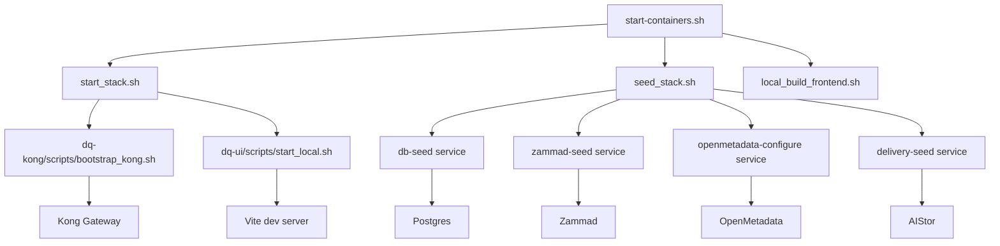

# Downstream Script Call Graph for start-containers.sh

- This layout omits utility scripts and focuses on the main orchestration and service interactions.
- You can further collapse or expand nodes as needed for your use case.
