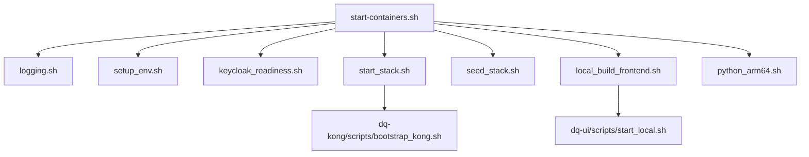

# Downstream Script Call Graph for start-containers.sh

- **Dashed lines** indicate indirect calls (e.g., start_stack.sh calls bootstrap_kong.sh).
- Only the main scripts are shown; some scripts (like logging.sh) are sourced by others as well.
- This diagram is based on the current structure of start-containers.sh and its most common downstream scripts.
